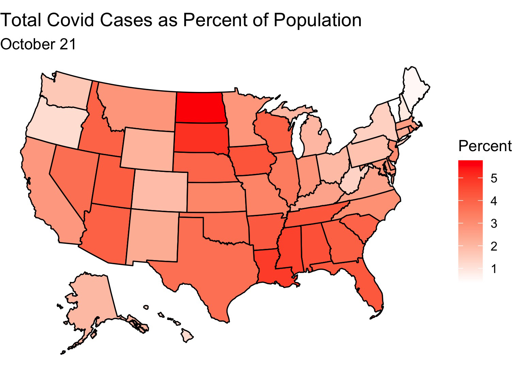
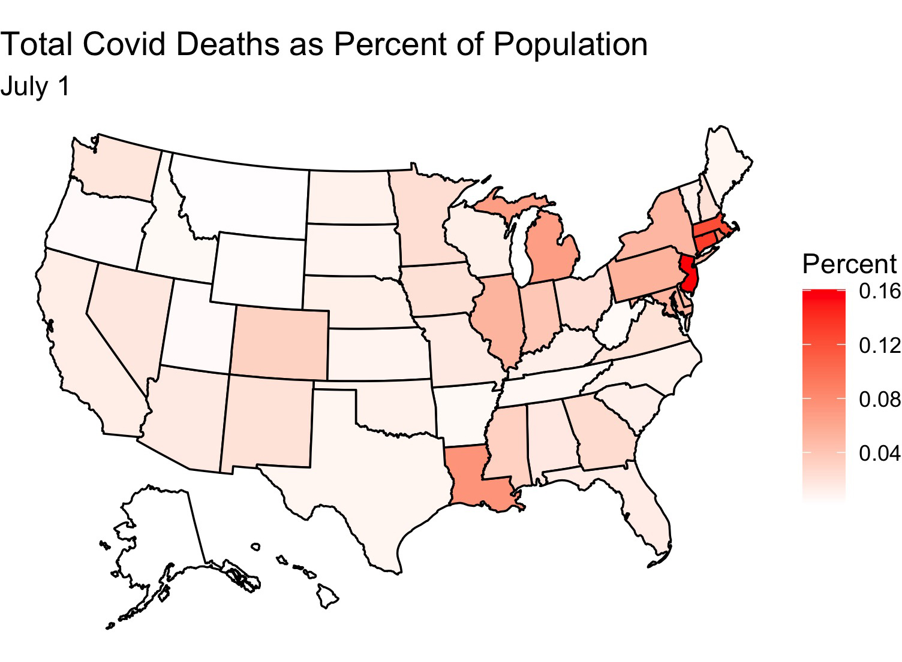
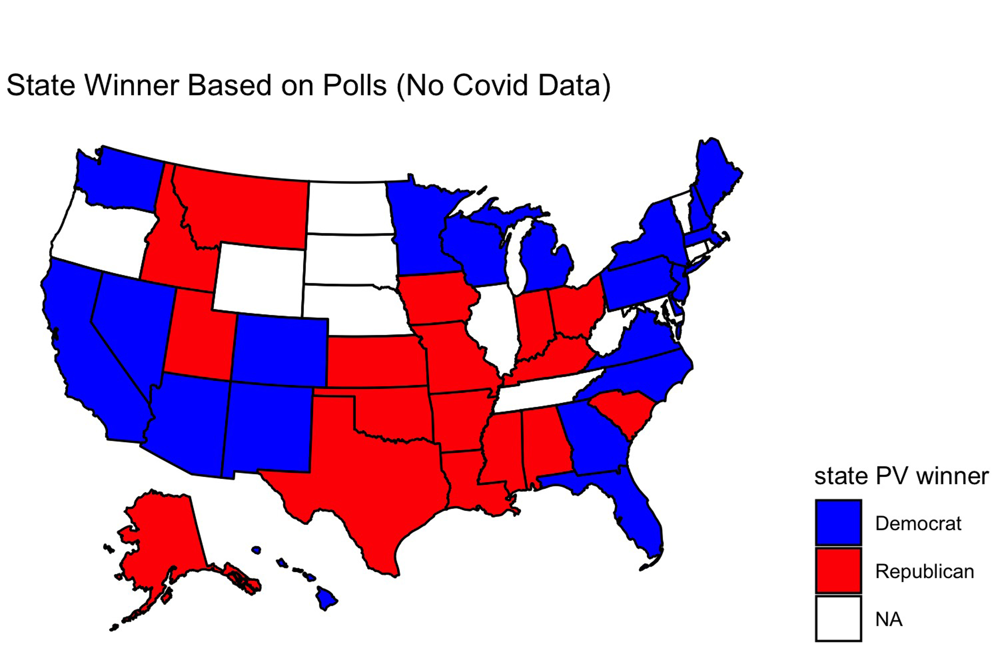
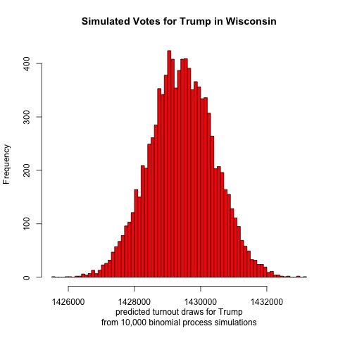
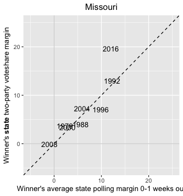

## Predicting the 2020 Election (Rick Brown)

### NARRATIVES

* Looking at change in voteshare doesn't capture counties with same voteshare but higher turnout. Higher turnout in a populated county could produce more Biden votes than a gain in voteshare in a very sparesly populated conservative county

* I exclude counties corresponding to small metros since they're likely a hybrid of suburbs and rural areas

* Some of the areas included in suburbs are rural (counties are included if they are part of a MSA)

https://www.cdc.gov/nchs/data_access/urban_rural.htm

Liked my findings? Find my code [here](https://github.com/rbrown146/Gov_Election_Analytics/tree/gh-pages/narratives)

### Week of 11/29: Election Messaging
It's relatively uncommon for incumbent presidents to be defeated when running for reelection. Trump is the first one-term president of the 21st century, and given the chaos in the world around us it doesn't seem *that* surprising that he bucked the presidential reelection trend. At the same time, Trump had a strong showing. He earned the second largest number of votes of any presidential candidate in history. This being the case, it seems doubtful that Biden won due to the public being overwhelmingly appalled at Trump's handling of national affairs. So was Biden's victory a result of pure luck or a well-organized strategy?

According to [Professor Lynn Vavreck,](https://hollis.harvard.edu/primo-explore/fulldisplay?docid=TN_cdi_askewsholts_vlebooks_9781400830480&context=PC&vid=HVD2&search_scope=everything&tab=everything&lang=en_US) whenever a favored candidate can connect him/herself to a strong economy then s/he should do so. The economy is by far the most important issue to most voters, and **whoever is seen as likeliest to nurture a strong economy usually wins.** If a favored candidate can plausibly link him/herself to a strong economy then the challenging candidate should find an issue on which the favored candidate is perceived as weak, and the challenging candidate should make this the focus of his/her campaign. This strategy usually is unsuccessful, but it is the best option available since challenging candidates who do not follow it always lose.

Who was the stronger candidate in this election? While pundits routinely favored Biden going into the election, I'm not sure that he had the upper hand. Yes, the economy took a nosedive once the coronavirus pandemic hit, but before that, most people perceived the economy to be booming. (Whether that was due to President Trump is debatable, but voters usually assign credit for a strong economy to the sitting president.) If voters perceived the coronavirus epidemic as a fluke event that no president could have averted then they might have associated Trump with a strong economy, in which case he would be the favored candidate. For the purposes of the this blog post **I'll assume that this was true and that Trump was the favored candidate going into the election.**

If Biden was the underdog in this election and if voters associated Trump with a strong economy then we would expect Biden to make another issue the focal point of this election and to do his best to downplay the strength of the economy under Trump. Throughout the campaign it did seem like that was Biden's strategy. I recall hearing Biden attack Trump for **dividing the country** and **incompetantly handling the coronavirus pandemic**, so I'll assume that these were Biden's key issues of the election. In this blog post, though, I'll treat the coronavirus pandemic as Biden's main issue. The question is how to determine if this was really part of the strategy?

Using the contents of each candidate's campaign speeches from 2019-2020, I search for 2-5 word phrases that contain words relating to the economy ("economy", "economic", and "financial") and to the coronavirus pandemic ("virus", "corona", "covid"). My results are shown below.

**Trump's most spoken 2-5 word phrases on the economy:**

Trump clearly views the economy as one of his strong points. "Greatest_economy" was the most commonly occuring economic phrase in Trump's speeches with 82 occurrences. The next most common phrase was "economy_history", which I assume was used in conjunction with the first phrase to say "greatest economy in history". ("economy_history" appears 66 times while the third most common phrase, "greatest_economy_history", appears 54 times.) All of the top 20 phrases are positive in tone, and many of them, such as "built_greatest_economy" (30 occurrences), seem to suggest that Trump is taking credit for the state of the economy. Even among Trump's top 40 economic phrases only one is negative in tone: "shut_economy" at position 21 (with 15 occurrences). Many of these occurrences might come from before the onset of the coronavirus pandemic, but even so, it is surprising that such little attention is drawn to the state of the economy following the pandemic. Of course, as the favored candidate, Trump would only damage his support by suggesting that the economy was ailing under his watch.

**Biden's most spoken 2-5 word phrases on the economy:**

Unlike Trump, Biden is more pessimistic about the state of the economy. His most uttered economic phrase is "economic_crisis", which he states 65 times. His second most uttered phrase is "economic_growth" (37 occurences), and taken out of context it is hard to say if this phrase was used to discuss current or future economic growth. Other top-ten phrases such as "economy_back" and "economic_recovery" suggest that Biden is emphasizing that the economy is not "great" like Trump implies. Interestingly, Biden's third most frequently used economic phrase is "economic_justice" (28 occurences). I imagine that he is calling for greater economic justice across the country for people of different races, but this could also refer to economic justice across geographic areas and high/low-skill jobs. No matter how Biden used the term though, I imagine that this phrase was used to criticize the current state of the economy. (I assume this based on the content of Biden speeches that I have heard.) Based on these findings, it seems like Biden followed the playbook of previous campaigns and tried to weaken voter's associations of Trump and the previously strong economy.

**Trump's most spoken 2-5 word phrases on the coronavirus:**

By far, Trump's most uttered coronavirus phrase is "china_virus", which he stated 77 times. Not only is this phrase derogatory, it seems to blame another country for a problem experienced globally. Trump's next 3 most uttered coronavirus phrases are "covid_covid" (66 occurrences), "covid_covid_covid" (42 occurrences), and "covid_covid_covid_covid" (22 occurrences). Undoubtedly these figures are inflated due to overcounting since "covid_covid" appears twice in the phrase "covid_covid_covid_covid". It's not clear how Trump used these phrases since the algorithm I use removes filler words, but in a number of speeches Trump did utter "covid, covid, covid covid" while expressing his contempt for the virus. For that reason, and since it seems hard to believe that any factually meaningful statement could be created from the phrase "covid_covid_covid_covid" (even if stopwords were added back), I take these statements as evidence of Trump's frustration with the coronavirus epidemic rather than calls to action. Together Trump's top coronavirus statements imply that usually when he discussed the virus it was to distance himself from it and its deadly effects. Rounding out Trump's top ten statements are calls to fight the virus ("defeat_virus", "kill_virus", and "vaccine_kill_virus") as well as a continuation of his repetitive covid calls ("covid_covid_covid_covid_covid").  

**Biden's most spoken 2-5 word phrases on the coronavirus:**

Biden doesn't discuss the coronavirus as frequently as Trump does, but whenever Biden does, he paints it as a crisis. In fact, his most-used phrase is "covid_crisis", which he says 23 times. Other top-5 phrases include "virus_control", "beat_virus", and "covid-19_pandemic", each of which appears 16 times. This suggests to me that Biden's coronavirus messaging is mostly about the seriousness of the epidemic and how he plans to fight it. While Trump also discussed fighting the virus, he seemed to do so less frequently than he complained about the virus. Biden also utters Trump's second-favorite phrase, "covid_covid", but he only does so 7 times, making it his 25th most spoken coronavirus phrase. However, Biden's top 50 covid phrases do not include any longer variations like "covid_covid_covid". Since stopwords are excluded from this analysis it is difficult to tell just how Biden used the phrase "covid_covid", but I imagine Biden used it to indicate the virus's seriousness. (I say this based on the few Biden speeches that I've heard.) 

#### What Does It Mean?
So, did Biden follow the underdog strategy? He did seem to downplay the strength of the economy, and he did draw attention to the coronavirus epidemic. Trump didn't seem to be particularly strong on this issue (he complained about it more than anything else), and he focused more on the strength of the economy. So it is quite likely that Biden did make the coronavirus epidemic a key issue of the election. However, my simple analysis of campaign speeches doesn't provide definitive proof of this. Biden seems to utter coronavirus phrases fewer times than he discusses the economy: his most-used coronavirus phrase was spoken 23 times whereas his most used economic phrase was used 65 times. I imagine that this is partly due to my search querries being too narrow (e.g. I didn't search for the term "pandemic" when I compiled coronavirus phrase data). Based on what I remember about the campaign season, though, I imagine that Biden did focus much attention on the coronavirus pandemic. But regardless of whether or not Biden did view it as a big issue, come January 20th, he will have no choice but to perceive the virus in such a manner.

Liked my findings? Find my code [here](https://github.com/rbrown146/Gov_Election_Analytics/tree/gh-pages/speeches)

### Week of 11/22: Election Trends
Now that my analysis of my election model has concluded, it's time to analyze broader historical trends in politics. Was this election an anomaly due to Trump and Covid? What better way to begin than to show maps with county-level election results from the past 6 elections?

With so many counties in the country (many of them small), it might be difficult to pinpoint changes in specific counties. However, several things pop out to me. The first is that counties in the upper-Midwest region have become redder over time. Iowa and Wisconsin in particular have become more conservative. This doesn't seem surprising given both states' recent propensity for Republican governors and senators. Additionally, several counties elsewhere have turned red, particularly in Arkansas, Maine, and upstate New York. Meanwhile, California has become bluer. But what stands out most of all is that the majority of counties seem to have voted the same way over all six elections. What's going on?

According to [Professor David Hopkins of Boston College,](https://hollis.harvard.edu/primo-explore/fulldisplay?docid=TN_cdi_askewsholts_vlebooks_9781108129183&context=PC&vid=HVD2&search_scope=everything&tab=everything&lang=en_US) the outcome of the 2020 election is merely a continuation of previously occuring trends. Over time politics in America have increasing become polarized; whereas in the days of Richard Nixon nearly every state was competitive, nowadays only a few swing states are that way. Those swing states are predominately located in the Midwest while states elsewhere typically vote for the same political party no matter the candidate running. 

Additionally, contemporary politics are defined by urban vs. rural battles. Densely populated areas usually vote for Democrats while their hinterlands vote for Republicans. This trend is more easily visible when one looks at counties that pivoted from one party to another over the course of several elections. Below I plot counties that pivoted in 2020 relative to 2000 and 2016:

There's a lot of blue in the above map, but it's mostly in rural areas. As predicted, these counties swung to the Republican party by the time of the 2020 election. Many of these blue-to-red counties are located in either the South or the upper Midwest. Meanwhile, red counties are much fewer, but they tend to represent urban centers. Notice the red-to-blue flip of counties representing the suburbs of Atlanta, Chicago, Denver, and DC as well as the cities of San Antonio, Dallas, Omaha, NE, Reno, NV, Jacksonville, FL, and Birmingham, AL. Additionally, the state of California as a whole seems to have become more Democratic.

There aren't as many changes between 2016 and 2020, but some appear nevertheless:

There are fewer blue-to-red counties that flipped, but those that did appear to be mostly in rural Texas and Mississippi. Meanwhile, many urban centers flipped from red to blue, among them the suburbs of Austin, TX and Kansas City and cities of Phoenix, AZ and Ft. Worth, TX. Within my homestate of Kansas, the counties containing the cities of Manhattan (my hometown!) and Topeka also flipped.

Seeing the above maps, it seems likely that this election was indeed a battle of rural vs urban, and its outcome was not an anomaly from previous elections. Suburban counties flipped from red-to-blue while a few rural counties flipped the other way. (The rural counties in Texas were located in heavily Hispanic areas, supporting the theory that a Hispanic shift to the right cost Biden Texas and similarly Hispanic states.) And yes, America seems as polarized as we've been hearing from the news - few counties flip between elections.

Liked my findings? Find my code [here](https://github.com/rbrown146/Gov_Election_Analytics/tree/gh-pages/election_outcomes)

### POST ELECTION REFLECTION
After nearly an entire week of anxiety and uncertainty, the 2020 election has wrapped up. Joe Biden will be the 46th President of the United States. My model predicted this outcome, but it wasn't entirely accurate. What did it do right, and what went wrong? I evaluate my model below.

#### Model Recap
To make predictions I use a binomial model that takes in polling and demographic data from each state and returns estimated votes for each major party candidate (Biden or Trump) in that state. Specifically, I input the racial and age breakdown of each state's population, and I also include changes in each of these demographic variables over the previous four years. I interact region with the variables that measure demographic changes over the prior four years. I assume that states will vote similarly to other states that are close by or have had similar demographic changes and voting histories, and I create seven regions using this reasoning (the regions are listed later in this post).

The model is trained using using presidential election results beginning 1992 with the exception of results from the 2000 election that were used to test the model's accuracy. For states with missing polling data, this data was estimated using polling data from nearby states. Finally, for a given candidate's initial voteshare prediction in a particular state, I generate 10,000 different voting scenarios. For each of this simulations, the candidate's predicted voteshare is randomly selected from a normal distribution with mean and standard deviation given by the model's initial prediction. I take the average of the results to produce my final estimate of the candidate's voteshare in that state.

#### Accuracy Measure
If you recall from my previous post, my model predicted that we would see this map on election night:

In actuality, this is the final map of the 2020 election:

At the time I unveiled my model I commented that I thought a red Oregon was highly unlikely. Indeed, Oregon voted for Biden. However, I was bullish on Biden and predicted that Biden might also win Texas and Iowa in addition to Oregon and the states on my map. In reality, Biden won neither Texas nor Iowa, and he also lost Florida and North Carolina. The final outcome of the election was Biden 306, Trump 232. I predicted that it would be Biden 343, Trump 195. I was "only" off by 37 electoral votes!

But where did my model go wrong? Pictured below is a bar graph of the size of my model's prediction error for each state:

* Note that bars are colored by color of party of actual state winner, not direction of error (e.g GOP, Dem)

If you recall, I was missing polling data for eight states/territories and had to estimate polling data based on values in nearby states. This resulted in predictions that were highly inaccurate in some states and fairly good in others. The states/territories for which I estimated polling data are listed below, followed by the rank of their prediction error relative to other states in the above chart (with 1 being the most inaccurate prediction and 51 the most accurate):

South Dakota (1), Rhode Island (2), Illinois (3), North Dakota (9), West Virginia (21), Nebraska (30), DC (41), Wyoming (49)

Whereas predictions for DC and Wyoming were close to the mark, those for South Dakota, Rhode Island, and Illinois were embarrasingly inaccurate. North Dakota's prediction also faired poorly. There doesn't appear to be a pattern to how these states fared - results were wrong in both populated Illinois and rural South Dakota and right in both liberal DC and conservative Wyoming. Four of these states were in the Midwestern region (SD, IL, ND, NE), one in the Core South region (WV), two in Northeast region (RI, DC), and one in the Rocky Mountain region (WY). Overall, predictions for states in the Midwestern region were terrible, but it is unclear why prediction accuracy for the two states in the Northeastern region was so far apart (Rhode Island was off by 35.08% while DC was only off by 2.79%). Looking at historical trends, it appears that voteshare for Democrats and Republicans is fairly stable across years in DC. Perhaps that explains why the model was so good at predicting polling data for DC. In general, my approach to estimating polling data seems to be fairly inaccurate.

What about results for states that *did* have polling data? The median error seems to be in the 5-7 percentage point range. While this accuracy isn't great, it is good enough to correctly predict the vote outcome in most states. The errors seem to be smaller in Democratic-voting states (e.g. MA, MI, VA) than in Republican-voting ones. Why is this? In general most polls seem to have underestimated the share of Trump voters in the country. (Trump won the popular vote by about 3.6 points when the polls had him losing by 10 points.) But I think that the regions I placed each state into had the largest effect on outcomes. States were grouped by the following regions:

**Core South** - AL, MS, TN, AR, LA, OK, KY, WV

**Sun Belt** - FL, GA, TX, NC, SC, AZ, NM, NV

**Northeast** - VA, MD, DE, NJ, NY, CT, RI, VT, ME, DC, MA

**Midwest Swing** - NH, PA, OH, MI, WI, MN, IA

**Midwest Stable** - IN, KS, NE, SD, ND, IL, MO

**Rocky Mountain** - CO, MT, ID, WY, AK, UT

**West Coast** - HI, WA, OR, CA

I placed New Hampshire with swing states in the Midwest because I thought this was a better group for it than the solidly blue states of the Northeast. However, results in New Hampshire were off by 10.36 percentage points, the most of any state in the Midwest Swing group. The next least-accurate state prediction in that group was for Iowa, which was only off by 3.92 points. This leads me to believe that New Hampshire does not, in fact, have many similarities with other states in the Midwest Swing group. New Hampshire should have been placed with the Northeastern states.

The Rocky Mountain states had the least accurate predictions. These were a mix of states that may not have had much in common with each other. For example, Utah's Mormons are a unique voting bloc that are concentrated in one state, Colorado is the lone state in the group that is reliably Democratic, and Alaska is unique in that it has a large Asian population that votes predominately for Republicans. Perhaps placing Montana, Wyoming, and Idaho with the Midwest Stable states, Colorado with the West Coast states, and Utah and Alaska in their own unique regions would have yielded better results.

Looking specifically at the direction of the prediction error in each state (e.g. more Republican or Democratic than reality) indicates that the model tends to overestimate the degree of partisanship in each state:

On average, Republican states were predicted to be more Republican than in actuality, and Democratic states were predicted to be more Democratic than actuality. Perhaps poor and limited polling explains why results were off in some states. Ohio had a polling error of essentially zero, and Minnesota was only off by 1.72%; both states were well polled this cycle. However, even if polling errors effected results, there are still a number of large errors that are unexplained. For example, results were off by 19.91% in Nevada and 8.9% in Florida, two well-polled states. While the polls may have been off in both states, they were not off by nearly as much as the size of the model's prediction errors for those states. Something about the model itself contributed to the errors.

One election observation that the media has emphasized is that a greater share of Hispanics voted for the Republican party than in previous elections. If this observation is true and it is an anomaly from previous elections then the model should be off (since it uses demographic information to predict election outcomes). This seems to hold true for several states with large Hispanic populations: looking at the ten states and territories with the largest share of Hispanic residents (informally estimated via [Wikipedia](https://en.wikipedia.org/wiki/List_of_U.S._states_by_Hispanic_and_Latino_population)), predictions were off by 19.91% in Nevada, 16.12% in New York, and 8.9% in Florida. It's well-documented now that Cubans in Miami voted for Trump in greater numbers than they did in 2016, but it's unclear if the same is true for Hispanics in Nevada and New York. Additionally, other states with large Hispanic populations had smaller predictive errors: Arizona (6.25%), Texas (2.8%), New Mexico (3.07%), California (5.25%). At least in the case of California and Texas, the model actually predicted greater support for Trump than actually played out. So while the model likely overestimated Hispanic support for Democrats in Florida based on past trends, this error seems localized to Florida. Perhaps it could have been rectified by placing Florida in the Core South region, where I assume Hispanics are more conservative. (Or rather, if Florida were left in the Sun Belt region and liberal New Mexico moved to a different region then that could help as well.) Alternatively, decreasing the weight of Hispanics in the model could have improved the predictive outcome since Hispanic voting trends are rapidly changing and past Hispanic voting patterns are no longer good predictors for future election outcomes.

Another election observation floating around is that Black turnout increased in several states, but the Black share of the electorate actually decreased due to an even greater share in non-Black voters turning out to vote. Since non-Blacks tend to vote more conservatively than Blacks, if Black turnout as a share of the electorate were especially low this election then we would expect the model to overpredict Democratic support in states with large Black populations. Errors do seem to be large in several of the ten states with the largest Black populations (informally estimated via [Wikipedia](https://en.wikipedia.org/wiki/List_of_U.S._states_and_territories_by_African-American_population)): 16.04% off in Alabama, 10.38% in Mississippi, 7.74% in South Carolina, 7.69% in North Carolina, and 7.22% in Maryland. However, in all but the Carolinas, the model overestimated the share of *Republican* support, not Democratic support. And several of the 5 states with the highest share of Black residents had especially low errors: DC (2.79%), Louisiana (0.38%), Georgia (1.14%). This suggests that Black turnout isn't what is affecting the model's prediction in most states, although it could explain why North Carolina was incorrectly predicted.

Finally, pundits have said anecdotally that this election saw larger turnout from younger voters than in past elections. Younger voters tend to be very liberal, so the model likely overpredicted Republican support in states with large young populations. This seems to be true. Looking at the ten youngest states by median age (informally estimated using [Wikipedia](https://en.wikipedia.org/wiki/List_of_U.S._states_and_territories_by_median_age)), the model overestimated Republican support in Utah, California, Alaska, Texas, North Dakota, Idaho, Nebraska, Oklahoma, and Colorado. It overestimated Democratic support in DC and Georgia, but by small amounts. This suggests that the model should be adjusted to put less weight on demographic information.

Why was Oregon off by so much? Likely this was due to its region. Of the four states in the West Coast region, Oregon has the highest share of white voters. Very little polling data was available for Oregon this cycle, so polling data was likely off. That, together with a large white electorate, undoubtedly caused the model to overpredict the amount of Republican support in the state. This seems to be another instance in which region and demographic data swayed the model's prediction.

The model did a poor job estimating votes for each candidate. The final vote outcome for nearly every state fell outside of my model's voteshare 95% confidence interval. This could be due to record turnout, but it's likely caused by improperly calculating standard deviation.

#### Testing hypotheses for why model was off

In an ideal scenario, I'd be able to test my hypotheses for why the model was off by running a controlled experiment, changing a few variables at a time, and examining the outcome. Obviously one cannot rerun the 2020 election without causing chaos and/or undermining democracy. However, we can simulate the election using the model. If the model yielded inaccurate results in Florida due in part to a Hispanic shift to the right, we could approximate for this by running the model again and underweighting the number of Hispanics in Florida and overweighting the number of whites (a more conservative voting block). Of course, one would need to know exactly how much to adjust the weights. This could be approximated by looking at the shift in Miami-Dade county compared to 2016 (a heavily-Hispanic county home to many Cuban-Americans). If one could somehow obtain voting data for different races then this could be used to see whether there was a Hispanic shift to the right relative to previous elections. 

To test whether especially low Black turnout as a share of total turnout led to inaccurate predictions, one could underweight the number of Blacks in a state and overweight the number of whites. Weights could be adjusted via trial-and-error, and if decreasing the number of Blacks in a state seemed to lead to more accurate predictions then that would support this hypothesis. Here, too, having current and historical voting data for different races could be used to find correlations between the model's predictive accuracy and the share of the electorate that was Black. States of particular interest are Alabama, Mississippi, North Carolina, and South Carolina (due to their large prediction errors). It's possible that only some regions were affected by a decrease in Black turnout relative to other racial groups' turnout.

If younger voters turned out in greater numbers this cycle then this could be approximated by overweighting the share of younger voters in a state and underweighting all other age groups. Here, as in other cases, it would help to have data detailing the ages of voters this election cycle and in previous ones. We could compare the predictive accuracy of the model in states with younger voter turnout in line with historical averages to the accuracy for states with higher young voter turnout than in previous election cycles.

All three turnout trends mentioned previously concern voter demographics. When creating the model I didn't have the most up-to-date demographic data - my information came from 2018, whereas the model used demographic data from the year of previous elections to predict the outcomes for those elections. If out-of-date data explains some of the predictive errors then this could be tested by gathering more recent demographic data and feeding it into the model.

Finally, if state results were biased based on which region each state was placed into then we could rerun the model placing different states into different regions. The accuracy of results should be determined for the 2020 election and previous elections. One could also eliminate regions entirely and see how that affects results.

#### Conclusion: Changes I'd Make If I Could Redo Things

Overall I am pleased with the performance of my model. Yes, errors were unacceptably high in states with no polling data, and the average error size was roughly in the 7 point range. But given the amount of time I had to create the model, the data that was available, and the level of my coding skills, I think I did well. That being said, if I were to go back and change things there are a few modifications I'd definitely make. 

The first thing I'd do would be to remove regions from my model. I think I defined regions too narrowly which caused some states to have results biased in line with other states in that region (e.g. Colorado's prediction was more conservative than the actual result because the other states in its region were very conservative. Instead I would lump states into three classifications: swing states, former swing states (states like Colorado, Missouri, and Virginia that aren't quite as partisan as the rest of the nation but also aren't competitive), and uncompetitive states. Hopefully this would fix the prediction error in Oregon.

Next I'd change my model to an ensemble model. I'd predict election outcomes using two models - one based on polls and another based on demographic information. Several errors I observed in my model's predictions seemed to be based on demographics (e.g. Cubans in Florida, Blacks in North Carolina), so I would give more weight to the polling component of my ensemble. Hopefully this would mean that shocks like a larger-than-average turnout of young voters wouldn't alter my model's predictions much.

Finally, I'd look for later polling data and use that to make predictions. This would alleviate the need to estimate polling data for states (which resulted in my three worst state predictions) and would likely give more precise estimates in other states as well.

So there it is. After many weeks of anticipation, the 2020 election is wrapped up, and so is my analysis of it. Thanks for reading!

Liked my findings? Find my code [here](https://github.com/rbrown146/Gov_Election_Analytics/tree/gh-pages/final_reflect)

### Week of 10/22: Final Election Prediction
After weeks of waiting, we are now only a few days away from the election. With secretaries of state predicting record turnout and political pundits calling the election the most important one in their lifetimes, this is no ordinary election. We may not know who will win just yet, but models can offer some insight during this stressful time. I present my election model.

#### Model Description

My model is binomial. That means that for a given population (in this case eligible voters in a state), it assigns one of two possible outcomes to each individual (in this case Democrat or Republican) based on a variety of inputs. I chose to input polling data, state demographic characteristics (race, gender, and age), and change in those state demographic characteristics over the past four years (or past two years when four years of data is not available). I chose not to include a variable indicating the change in a state's gender composition over the past four years because this didn't improve results - I figure that gender composition is fairly stable across time. 

There is a lot of variation in how voters of each race vote - white voters without college degrees are much more conservative than those who graduated from college. While my model doesn't account for voter educational status, it can look at other changes in demographics that proxy for this. States that have a large increase in Millenials compared to four years prior probably are popular destinations for college educated voters (since our nation's fastest growing industries are increasingly dependent on skilled workers), and a large share of voters in these states are likely educated persons who lean to the left. States with a growing share of retirees might have characteristics that appeal to the conservative, older generation, in which case the model should predict more Republican support in such states. And perhaps states that attract a diverse range of newcomers are more inclusive than others and attract the same types of minorities that are drawn to the Democratic party. 

Because voters differ by region, e.g. Hispanics in California are probably more liberal than those in Florida, I interact variables for the change in state demographic characteristics with an indicator variable for region to enable predictions based on demographic characteristics to vary for each region. Finally, to account for more variance in poorly polled states (e.g. Kansas), I include an interaction term between polling average and an indicator for each state. This tells the model to adjust how much weight it puts on polling data depending on how accurate such data usually is for that state.

To create my model, I used data from each US presidential election since 1992. I held back data for the election of 2000 so that I could test my model  out-of-sample, and I also tested my model in-sample using data from 2016. I averaged polling data from April through mid-September of election year to create my polling average variable. (Data before April probably is too far out to be useful, and data from mid-September was the latest polling data I had for the 2020 election.) Seven states and the District of Columbia had missing 2020 polling data, so I predicted what their 2020 polling data would be using a model that took in polling data from other states (e.g. my model looked at how Nebraska polled in prior years compared to 43 states with polling data, and it then took in 2020 polling data from those 43 states to predict how Nebraska would poll in 2020.) Demographic data is from 2018, and statistics on the size of each state's voting-eligible population are from 2016 (the latest data I had available).

After my model predicted the voteshare for each candidate in each state, I simulated 10,000 different voting scenarios. I inputted the mean prediction from my model as well as its standard deviation so that each simulation would produce slightly different results. Finally, I averaged the results for each candidate to create my final prediction.

#### Model Formula

The model has the following structure:

Democratic voter turnout = **-2.137 - 0.024** x avg. Dem. poll support + vector of state fixed effects + vector of state offsets to avg. Dem. poll suport + **0.117** x % Hispanic population + **0.202** x % Indigenous population **- 0.885** x % Asian population + **0.056** x % Black population **- 0.007** x % population aged 30-45 + **0.035** x % population aged 20-30 + **0.008** x % population aged 65 and older **-0.073** x percentage change in population aged 30-45 over past 4 years + **0.036** x percentage change in population that is Hispanic **- 0.068** x percentage change in population aged 65 and older **- 0.074** x percentage change in population aged 20-30 + **0.201** x percentage change in population that is Black **- 0.073** x percentage change in population that is Asian **-0.034** x percentage change in population that is Indigenous + vector of regional offsets to percentage change in each race/ethnicity + vector of regional offsets to percentage change in each age group

The model for Republican voter turnout has the same format except that it uses Republican poll support. 

What do the coefficients on each of these terms mean? They tell you how much to adjust the predicted Democratic voter turnout depending on whether each given variable is true. For example, the coefficient of 0.117 on % Hispanic population indicates that if 1% of a state's population is Hispanic then the state should have 0.117 more Democratic support than a state that is otherwise identical except that it has no Hispanic population. For every additional percentage of a state's population that is Hispanic, add 0.117 more predicted Democratic support. 

The model defaults to predicting the outcome for a hypothetical Alabama populated only by white males aged 45-65 with no Democratic poll support and no population (paradoxically). For such a state, the model predicts Democratic voter turnout of -2.137, a value that does not correspond to an actual probability since probabilities are between 0 and 1. Interestingly, the model predicts a *decrease* in Democratic support as the share of Millenials (aged 30-45), Asians, and Democratic poll support increases. However, state fixed effects and interaction terms work to counteract this. For example, California has a large state fixed effect of 4.50. DC, however, has a state fixed effect of -8.55. DC has a large Black population, though, and the model predicts that every percentage of a state's population that is Black increases its support for Democrats by 0.056. The regional offset for Black population indicates that on top of that 0.056 support, states in the Northeast have an additional 0.064 boost, meaning that a 1% increase in a Northeastern state's Black population as a share of its total population will cause its Democratic support to increase by 0.12. No state has a negative predicted share of Democratic voter turnout, so these offsets help to counteract the model's intercept of -2.137 and the coefficient of -0.024 on average Democratic poll support.

Now that I've covered the workings of my model, it's time to present its 2020 prediction...

#### 2020 Prediction

This map is interesting, but it's undoubtedly incorrect. Oregon is a very liberal state and most likely will vote for Biden. Besides Oregon, though, this map line ups with the forecasts of pundits who are bullish on a blue wave. My model doesn't account for congressional-district allocation of electoral college votes in Nebraska and Maine, but I personally predict that NE-02 will go for Biden and ME-02 for Trump. Additionally, I think that if Biden wins all of the states on this map plus Oregon then he probably will win Iowa and Texas as well.

Several states in this model are close. Biden wins Michigan by 0.34%, Georgia by 1.42%, and Wisconsin by 4.40%. Trump wins Oregon by 1.04%, South Carolina by 4.11%, and Iowa by 4.47%. These values might prove realistic should there be an actual blue wave. But other values seem unrealistic. Biden wins Nevada by 22.73% when Democrats carried the state by single digits in 2016 and 2012, and Trump carries South Dakota by 78.17% when his margin in 2016 was roughly half that. It's worth noting, though, that South Dakota is one of the seven states that had no 2020 polling data, so predictions for this state are likely to be noisier than for states with actual polling data.

Here are some statistics on my prediction:

**Electoral College Vote:** Biden 343, Trump 195

**National Popular Vote:** Biden 52.36%, Trump 47.64%

**Biden Vote 95% Confidence Interval:** (67,418,974 - 68,163,003)

**Trump Vote 95% Confidence Interval:** (61,523,836 - 61,819,065)

Next, let's see how the model performs out of sample:

#### 2000 Prediction (Out-of-Sample Validition)

Several states are incorrect in this model. Bush actually won Arizona and Florida while Gore carried New Mexico, Wisconsin, Michigan, Pennsylvania, and  Delaware.

Here are some election statistics from this hypothetical 2000 election outcome:

**Electoral College Vote:** Gore 239, Bush 298

**National Popular Vote:** Gore 50.70%, Bush 49.30%

**Gore Vote 95% Confidence Interval:** (53,278,740 - 53,913,560)

**Bush Vote 95% Confidence Interval:** (51,988,389 - 52,246,215)

In comparison, here are statistics on the [actual results:](https://www.270towin.com/2000_Election/)

**Electoral College Vote:** Gore 266, Bush 271

**National Popular Vote (Two Party Vote):** Gore 50.27%, Bush 49.73%

In both the model and in actuality, Gore wins the popular vote and loses the electoral college. So on the single most important metric of any election forecast - picking the winner - this model passes.

Finally, here are some interesting state level statistics. In my model, Gore wins Arizona by 4.60%, Florida by 6.90%, Oregon by 11.33%, and Hawaii by 3.21%; Bush wins Michigan by 4.3%, New Mexico by 25.332%, and Georgia by 3.32%.

In actuality, [it seems](https://en.wikipedia.org/wiki/2000_United_States_presidential_election) that Bush carried Florida by 0.0092%, Arizona by 6.29%, and Georgia by 11.69%. Gore won New Mexico by 0.061%, Michigan by 5.13%, Oregon by 0.44%, and Hawaii by 18.33%. I've specifically highlighted these states to show the inaccuracy of the model, but it's worth noting that not all states were off by this much.

Lastly, let's see how the model performs in-sample.

#### 2016 Prediction (In-sample Validition)

The model does a better job at predicting state winners in this election. The only states that are off are New Hampshire (Clinton actually won) and Pennsylvania (Trump actually won). The model also doesn't account for ME-02 going to Trump.

Here are some statistics:

**Electoral College vote:** Clinton 244, Trump 287

**National Popular Vote:** Clinton 52.00%, Trump 48.00%

**Clinton Vote 95% Confidence Interval:**(64,324,375 - 65,068,005)

**Trump Vote 95% Confidence Interval:** (59,564,256 - 59,858,909)

And here are the [actual results](https://www.270towin.com/2016_Election/)

**Electoral College Vote:** Clinton 232, Trump 306

**National Popular Vote (Two Party Vote):** Clinton 51.11%, Trump 48.89%

Here, too, the model correctly predicts that Clinton wins the popular vote and loses the electoral college. Additionally, the few states that the model incorrectly predicts aren't too far off from actuality: in the model Trump wins NH by 2.34% and Clinton wins PA by 5.23%. Trump wins Michigan by 1.82% and Clinton wins Minnesota by 9.00%.

[State results](https://en.wikipedia.org/wiki/2016_United_States_presidential_election) show that Trump won Michigan by 0.23% and Pennsylvania by 0.72% while Clinton won New Hampshire by 0.37% and Minnesota by 1.52%. The model's prediction for Minnesota seems off, but it does a good job predicting the other states.

#### Conclusion

What are some takeaways from this model? In both the 2000 and 2016 election it correctly predicted the electoral college and popular vote winners, and its 2020 prediction seems mostly feasible. In all three forecasts the model gives a very narrow confidence interval for each candidate's predicted voteshare, which places serious doubt on the model's ability to accurately predict the popular vote count. But percentage-wise, at least, it isn't too far off. The model works fairly well in-sample, but it is much worse at predicting out-of-sample. It could be true, however, that the model is biased towards recent changes in voting in the USA - it was constructed using 2016 data, after all, and it incorrectly gave Wisconsin, Michigan, and Pennsylvania to the Republican candidate in its out-of-sample prediction. If this is the case then that bodes well for Biden come November 3. 

Now that the model's prediction has been made, all that is left to do is wait until Election Day. Soon enough we will be able to measure its accuracy. Until then, happy voting!

Liked my findings? Find my code [here](https://github.com/rbrown146/Gov_Election_Analytics/tree/gh-pages/Final)

### Week of 10/18: Covid
This election has had many shocks compared with previous elections: protests, a president who doesn't pay much tax, the death of a Supreme Court justice weeks before the election, and, of course, Covid. How will Covid affect the election? I decided to make a model to find out. But first, here are some maps showing the extent of Covid's spread through the United States:

Between July 1 and October 21 Covid has spread greatly through the USA

It looks like the virus has made inroads into the central part of the country and is doing best there. Deaths have also increased, although by not nearly as much as cases have (perhaps due to the uptick in mask wearing and social distancing)

And now for my model!

**Model**

I used the same base model to predict the outcome of the election. This time, however, I used data on the share of Covid cases as a share of each state's population on September 1 and I used that to predict the polling average for the election in that state. I then fed in Covid data from Oct. 21 to see what the model would predict for the election outcome. Again I simulate 10,000 different election outcomes and include standard deviation in my model. I take the mean prediction for each candidate to predict the election winner. The following map shows my result:

This map looks a lot like most pundits' forecasts at the time. After pondering my model for a while, I realized that it didn't include proper controls. Although at first Coronavirus cases were concentrated mostly on the coasts, more recently Covid has spread fastest in more Republican leaning states, perhaps because people in these states are more likely to emulate the president and go without wearing masks. Since this model looks at changes in covid cases to predict polling, it might actually be modeling concentrations of GOP voters rather than Coronavirus cases since the two go hand-in-hand. I decided to create a new model, this time including 2016 election results to act as a control. I reason that voters in states have more-or-less similar political affiliations as they did four years ago. Obviously there have been demographic changes since then and other factors (e.g. the economy) have changed, but I use this model mostly for comparison:

Only one state changes - Georgia. Now Georgia votes for Trump. This is in line with what happened in 2016, but I wonder now whether the model is leaning mostly on the 2016 election result rather than the coronavirus data when making its prediction. So I created a map of which candidate would win each state if the polls up to September accurately modeled the election outcome:

This map looks identical to the one yielded by the covid model wihout 2016 data. Perhaps, then, covid cases as a fraction of the state's population is not a good predictor of the election outcome - this data seems to get drowned out by other variables in the data. To test this, I looked at the predicted election outcome for each candidate yieled by each model:

These figures are for Georgia.

Polls only -  **Biden 50.06%, Trump 49.94%**. 

Covid Data - **Biden 49.86%, Trump 50.14%**. 

Covid Data + 2016 results – **Biden 49.98%, Trump 50.02%**

These changes are fairly small, and such is the case in other states as well (in North Carolina Biden does 0.6% better in the Covid Data + 2016 results model vs the plain Covid Data model, but in Ohio he does worse by 0.09%). So perhaps changes in the share of Covid cases in each state will have an effect on the outcome of the election, but likely the changes won't be substantial between now and election day.

Liked my findings? Find my code [here](https://github.com/rbrown146/Gov_Election_Analytics/)

### Week of 10/11: Demographics
Last week's histograms were quite interesting (a blue Texas!) but didn't seem like realistic predictions to me. This week I increased the accuracy of my model and tried again. I started out with the same binomial model that related pre-election polling data to the share of Democratic/Republican voters as a share of total voters in each election. I then inputted 2016 data on the number of eligible voters in each state and 2020 polling data. Unlike last time, this time when I was simulating 10,000 different election outcomes I allowed for some variance in the probability of each candidate winning (I added in standard deviation to my model and used a normal distribution to select win probability). Finally, for each candidate I took the mean of the number of expected votes for him in each election simulation. I then produced a map indicating which candidate would win the election assuming the mean vote values corresponded to the result on election day.

Once I produced a map using this more refined model, I adjusted my map by adding in various demographic variables (e.g. the fraction of a state's population that is female) to see how that would affect my outcomes. Adding in these demographic variables yields some wild predictions that are likely inaccurate. 

Ten states had no polling data for this election, so in the maps below they appear without color. And now, without further ado, I present my results:

**Plain map (last week's data):**

This map looks like most pundits' forecasts of the election. Biden wins Michigan, Pennsylvania, and Wisconsin, the three pivotal states that gave Trump the presidency last election. But it's interesting that Biden loses Arizona. Most polls seem to have Biden ahead there, and polling also suggests that it's a given that the Democrats will win the Senate race in Arizona. I'm surprised that Biden loses Arizona but wins North Carolina, Florida, and Ohio, three states that are all polling for Biden but seem to be trending more in Trump's direction. It's worth noting that my model only uses polling data from June to September 2020, so perhaps this explains its prediction.

**Adding in share of female residents:**

The model doesn't change its prediction much once it accounts for the share of each state's population that is female. Using this data, Idaho votes for Biden and Ohio for Trump. Ohio voting for Trump seems plausible to me, but I doubt Biden has a serious chance at winning Idaho. In general women tend to vote for Democrats at greater rates than men, so perhaps the model is capturing an increase in the share of Idaho's population that is female.

Across the United States as a whole results are fairly close for each candidate, as evidenced by this voting density map:

Idaho appears to be about the same shade of blue as Nevada, a state that is fairly competitive in elections. Given Idaho's population boom, the growth of its tech industry, and the tendency for western states to trend towards the Democrats over time, I wouldn't be surprised if Idaho eventually becomes as competitive as Nevada, but that likely will happen in the distant future.

**Adding in share of white residents:**

Building upon the previous model, adding the share of white residents produces strange results. Idaho no longer votes for Biden, but suddenly neither do Florida, Pennsylvania, and Maine. All three of these states gave votes to Trump last election, so perhaps this model is onto something. White voters do tend to vote Republican more than voters of other races. But Alabama and Mississippi vote for Biden, which doesn't seem likely to me. The Democrats ran a competitive candidate for governor in Mississippi yet lost the election, and in Alabama the Democratic candidate for senator only narrowly beat out a truly repulsive Republican one (Roy Moore). I like this model overall, but I think that weighting the share of white voters might produce better results. 

**Leaving out share of white residents, adding in shares of various minority groups:**

This map looks strangest of all. It adds in the share of each state's population that is Asian, Black, Hispanic, and Indigenous. Suddenly Biden loses Colorado and Virginia, two states that were once more competitive but now seem more like safe Democratic states. He also loses Michigan and Wisconsin, and compared to the previous map, no longer holds North Carolina or Mississippi. If Trump had a stronger showing than he did in 2016 I could see him picking up Colorado and Virigina, but I think he'd win Nevada, Minnesota, and New Hampshire first (all are polling closer than Colorado and Virginia). Biden still retains Alabama in this map, but now he holds Maine and wins Montana and Texas. I'm puzzled by why this would be. Alabama has a large Black population, but so do Georgia and North Carolina. Texas has a large Hispanic population, but so do Arizona and Florida. Texas did lean more Democratic last election cycle, and most states trended more Republican, so perhaps this explains some of the variation. The Montana result is most surprising, though, especially when you examine the predicted voteshare in that state.  

Assuming that each candidate received the median number of votes indicated by each histogram, Trump would receive 122,000 votes and Biden 426,000. That would yield a two-party voteshare of **Trump 22.3%, Biden 77.7%**, making Montana _the most Democratic state in the nation_ in 2020. That seems extremely unrealistic, although I do believe that on a good election night Biden could pick up Montana and Texas.

Overall I am fascinated by these models, but I definitely think that they could be refined with weights. I'm also surprised that in none of these predictions does Arizona vote for Biden. I think Biden will win there this election. We'll just have to wait until election night to see what actually happens!

Liked my findings? Find my code [here](https://github.com/rbrown146/Gov_Election_Analytics/blob/gh-pages/10_16/)

### Week of 10/4: Histogram Simulations

This week's blog post models possible outcomes of the 2020 election in key swing states. To generate these histograms, I first made a binomial model relating past election outcomes to pre-election polling data. Specifically, my dependent variables were the share of Democratic/Republican voters in a given election as a fraction of eligible voters. I then fed in the latest polling averages for each party's candidate in each state as well as the size of the 2016 voting eligible population in that state. I repeated this process 10,000 times for each party's candidate and finally generate histograms of the results. The result shows a spread of how many votes Biden and Trump are projected to receive based on current polling averages and past voter turnout for each party.

First, let's look at results from **Nevada**

This Sun Belt state has become more Democratic in recent years, and the histogram supports this trend. It looks like Biden is projected to receive a mean of 549,000 votes while Trump is projected to receive 469,500. If both candidates received this many votes then the two-party voteshare would be **Biden 53.9%, Trump 46.1%** out of 1,018,500 votes cast. Based on a Google search of Nevada's population, this suggests a voter turnout of 1/3 of all Nevadans. (Not all are eligible voters, though.)

Next up is **Wisconsin**

It looks like Biden is projected to receive a mean of 1,562,000 votes and Trump 1,429,000 votes. Such an election outcome would yield a two-party voteshare result of **Biden 52.2%, Trump 47.8%** out of 2,991,000 votes cast. If this outcome occurred then it would be nearly a flip of the 2016 election. This result would be closer than the model's projections for Nevada, which makes sense given that Nevada voted for the Democratic candidate in 2016 while Wisconsin did not.

Fellow Midwestern state **Ohio** is next

Always a swing state, last cycle Ohio was notable for swinging further to the right than it has in recent memory. This model suggests that Ohio will continue its GOP voting streak this election: Trump is projected to receive a mean of 2,822,000 votes and Biden 2,724,000. This would put the two-party voteshare at **Biden 49.1%, Trump 50.9%** out of 5,546,000 votes cast. 

Finally, let's look at **Texas**

The results are surprising. The model projects a mean of 5,515,000 votes for Biden and 4,844,000 votes for Trump. That would result in a two-party voteshare of **Biden 53.2%, Trump 46.8%**. If this were true then Biden would have a larger victory in Texas than he would in Wisconsin. Given the conservative history and close polling of Texas, however, this outcome seems highly unlikely. Even if the outcome fell on the left tail of the Democratic simulated voteshare, Biden would still be projected to win. Therefore, it seems likely that there is some flaw in the model.

The results found in this blog post should give Biden supporters reason to be optimistic, assuming the model's projections hold true. Given the crazy events of 2020, perhaps a Democratic Texas isn't that implausible after all.

Liked my findings? Find my code [here](https://github.com/rbrown146/Gov_Election_Analytics/blob/gh-pages/2020histograms.R)

### Week of 9/27: Incumbency

This election cycle there is an incumbent running for reelection. What does this mean for President Trump, and should we expect 2020 to differ from previous years?

#### Why 2020 Could be Different

It's a well observed fact that incumbent candidates are reelected at extraordinary rates. (Think of how many presidents over the past 70 years failed to win reelection.) One might think that this is due to constitutent loyalty to the exisiting holder of a particular office. However, surprisingly, it turns out that in the abstract voters have no preference for [incumbent candidates.](https://hollis.harvard.edu/primo-explore/fulldisplay?docid=TN_cdi_proquest_journals_1680832786&context=PC&vid=HVD2&search_scope=everything&tab=everything&lang=en_US) Rather, it seems that sitting presidents are able to direct spending to pivotal districts, thereby using the power of their office to [boost support.](https://hollis.harvard.edu/primo-explore/fulldisplay?docid=TN_cdi_proquest_journals_1018073231&context=PC&vid=HVD2&search_scope=everything&tab=everything&lang=en_US)

Does that mean that President Trump is likely to be reelected? Several factors suggest otherwise. For one, the coronavirus has ravaged America, shutting down gatherings and disrupting Americans' normal way of life. Additionally, because of the shutdowns, American businesses and workers are hurting. Unemployment is high and GDP growth is negative. If incumbents have an advantage due to crafty use of resources, then given the chaos that is America at the moment, this situation will not hold for the 2020 election. Perhaps voters may associate the president with the stimulus bills passed by Congress earlier this year, but there is no indication that that is the case, and even if it were, the goodwill earned from those pieces of legislation may have worn off by now. The most recent instance that I can recall of the president using his power to restore normalcy to the country was when he claimed to be "bringing back Big 10 football", which hardly seems like the type of resource deployment that is likely to sway voters.

The state of the economy aside, the strength of the incumbency effect seems to be wearing off in recent years [as voters become increasingly polarized.](https://hollis.harvard.edu/primo-explore/fulldisplay?docid=TN_cdi_proquest_journals_2185149144&context=PC&vid=HVD2&search_scope=everything&tab=everything&lang=en_US) Recall that the president did not win the national popular vote last election. This was also true at the state level, as he carried several key states such as Pennsylvania, Wisconsin, and Michigan with only a plurality and not majority of the vote. Voters turned to third party candidates in higher numbers than usual during the 2016 election, in part because they did not like either major party candidate. In this election, however, President Trump's opponent Joe Biden does not provoke the same degree of disgust as Hillary Clinton did in 2016, judging from the polls. Meanwhile, Trump's approval rating has stayed nearly constant during his first term, suggesting that he is unlikely to pick up additional supporters this election cycle.

#### Playing with Models

Interestingly, not all incumbents are treated the same. At the presidential level, while incumbent *candidates* tend to be reelected at high rates, incumbent *parties* that are not running incumbent candidates tend to lose elections more often than not. (Thank you to Professor Ryan Enos for providing this fact!) I decided to make a model to analyze differences in reelection rates for incumbent parties when they run incumbent candidates as opposed to new candidates in elections. To do this, I first found a high quality model produced by my classmate [Yao Yu](https://itsyaoyu.com/blog/gov-1347-polls/) that used Florida state polls and GDP data to predict the state winner during the 2020 election. I tweaked the model so that it utilized state economic data rather than national data, and I changed the economic variable of interest from GDP data to the state unemployment rate. Finally, I fed polling data from North Carolina and Iowa into this new model to predict the winner of those states in 2020.

The model works by looking at polls taken no more than 20 weeks out from the election, and it combines this information with unemployment data taken in April during the year of the election to make its predictions. (Why April? Political scientists have shown that, to the extent that voters look at economic data at all, they scrutinize data from towards the beginning of election year when judging an incumbent party's [performance.](https://hollis.harvard.edu/primo-explore/fulldisplay?docid=TN_cdi_askewsholts_vlebooks_9781400888740&context=PC&vid=HVD2&search_scope=everything&tab=everything&lang=en_US)) Using election and polling data from as far back as 1976, the model is then trained on some previous years' data while some data (40% of available data) is held in reserve for testing. The model is then applied to the testing data and the entire dataset to see how accurately it can predict the outcome of past elections. Once that is determined, the model is applied to current 2020 polling data to predict whether Trump or Biden will win a given state.

For each state I model two different scenarios: when an incumbent incandidate is running for reelection (which I call the "complex model"), and when an incumbent party is running a new candidate for election (which I call the "simple model"). Results are shown below:

**North Carolina**

For 2020, the **complex model** predicts **Biden 50%, Trump 46%.** The **simple model** predicts **Biden 50%, Trump 48%**

**Iowa**

For 2020, the **simple model** predicts **Biden 37%, Trump 55%**. The **complex model** predicts **Biden 37%, Trump 50%**.

Are these models correct? Likely not. Biden earning only 37% of the vote in Iowa seems far off to me. Even though the models perform well on the test data, polls for each election are likely correlated with each other. Additionally, the models would likely be more accurate if they took into account demographic factors for each state and if there was more training data. If the models happen to be correct, however, then expect to see Iowa stay red and North Carolina turn blue in 2020. 

Liked my findings? Find my code [here](https://github.com/rbrown146/Gov_Election_Analytics/blob/gh-pages/04-Incumbent.R)

### Week of 9/20: Polling

#### Comparing Polls
How should one design a poll to best predict an election? Of course there is no one answer to this, so it is interesting to examine the approaches taken by various top pollsters. In this post I'll examine two such models: one by [FiveThirtyEight](https://fivethirtyeight.com/features/how-fivethirtyeights-2020-presidential-forecast-works-and-whats-different-because-of-covid-19/) and the other by [The Economist](https://projects.economist.com/us-2020-forecast/president/how-this-works).

To make its prediction, **FiveThirtyEight** takes in polls and adjusts them in three ways: by how likely participants are to vote, by the political leaning of the pollster, and by the closeness of the polling date to election day. Of course there are other adjustments, too, especially in this time of uncertainty – FiveThirtyEight adjusts polls to account for economic uncertainty, number of COVID cases, and how difficult it is to vote in a particular state. In general, the approach is to rely mostly on polling data; fundamentals (e.g. growth in GDP since the last election) are weighted less than polls, especially as election day approaches. Predictions also are weighted to account for prior election results, demographics of those polled, incumbency effect, home state advantage, and how much a given state usually swings.

Unlike FiveThirtyEight, **The Economist** relies more on fundamentals. The Economist created numerous models based on prior election data that were weighted based on factors like GDP growth and how long a party has held the presidency (The Economist penalizes a party for holding the office for more than two terms). This process is then repeatedly on the state level, adjusting for partisan lean and correlating results for states with those of other states that have similar characteristics. Like FiveThirtyEight's model, adjustments are made for states based on prior election results, number of likely voters, and how much each state typically swings between elections.

While both pollsters use polls and fundamentals, the importance of each factor varies by pollster. Both FiveThirtyEight and The Economist recognize that there will be partisan leans to polls and bumps for certain candidates that are only temporary. They attempt to account for this. Both view the economy as a noisy predictor of the election. Both also vary the weight assigned to fundamentals and polls over time. However, the Economist does so much later in the process; its model does not use polls at all until about the end of June, and it does not extensively rely on polls until the week of election day. In contrast, by the end of June FiveThirtyEight's model assigns nearly 70% weight to polls, and this percentage jumps to nearly 84% when the election is still two months away. The Economist's model seems to rely more on coding and statistical techniques than does FiveThirtyEight's model.

Which model is best? Both have fairly good track records. (Although this is the first time the Economist is using its model, the model has been used to predict prior elections.) Because of the increasing polarization of America I'm inclined to believe that there will be fewer swings between elections, in which case a more fundamentals-based model will give the best results. Polls should also reflect this polarization (and they do), but as evidenced by the 2016 election, certain demographics seem to be underrepresented in polls. (E.g. white men without college degrees.) That being said, the polls may not have been as far off in 2016 as many might believe (see below blog post). So there is reason to believe that both models could yield accurate predictions. Given the turbulence caused by the coronavirus epidemic, however, I think it is best to rely more on polling this cycle since it isn't clear if the fundamentals will apply when there are huge shocks to the economy and a virus circulating rampantly through the population.

#### Analyzing 2016 Polls
After Donald Trump won the presidential election in 2016, the American public was shocked. The polls had led most people to expect a Clinton victory, yet that was not so. Many faulted pollsters for overlooking the Rust Belt region when forming their predictions. But just how far off were the polls in these states compared to previous elections, and was there reason to criticize most election forecasts?

Let's first take a look at Wisconsin. Using past polling data gathered within a week out from prior elections we can plot the average polling result from the eventual winner in comparison to actual voting data for that election:

Compared to the week-out polls, Trump received about 5 points more support than expected. The polls were certainly off by more than in 2012 (~3 pts off) and 2008 (~2 pts off). But compared to the 1984 election (~7 pts off) and 1988 election (~5 pts off), the error doesn't seem unreasonable. Of course, since the 80s technology has improved, and we would expect polling data to improve along with it. It isn't clear, then, how we should interpret this result.

Perhaps taking a look at Michigan will help somewhat: 

Michigan seems to be better polled than Wisconsin. The polls for 2016 were only off by about 3 points. This is an improvement from 2012 (~5 pts off), and 2008 (~4 pts off). Polling from 1988 appears to be off by about 5 points.

How does this compare to states outside the Midwest? Let's look at Florida:

Florida's polls were only off by about 2 points in 2016, an amount comparable to the error from 2012 and much smaller than in 2004 (~4 pts) though larger than in 2008 (~1 pt). Of course, as a perennial swing state, Florida might be better polled than most states. But it is encouraging to see that Michigan's polls weren't much further off than polls in Florida.

Next, let's look at Missouri, another Midwestern state but one that hasn't been competitive since 2008. (But a state for which there is still much polling data):

Polls for 2016 are noticeably off compared to other years. It looks like the difference between the predicted and actual outcome is 7 points! Prior to 2016 the polls were most off in the year 1996 by about 3 points. Michigan was definitely better polled in 2016 than Missouri, and even Wisconsin's polling looks better in comparison. While results for Missouri are probably off due to underpolling, it is worth noting that the state had competitive races for Senate and governor in 2016 – consequently, we would expect pollsters to devote considerable amounts of resources to surveying Missourians that year. 

Finally, let's look at some correlation statistics for each state. The table below shows R-squared values for the relationship between state polling data and the national popular vote (column 2) and state popular vote (column 3). To measure the noteworthiness of 2016 results, an R-squared value is calculated for each state with and without results from 2016:

Removing results for 2016 doesn't change state polling/vote R-squared values for Michigan and Florida! Results from 2016 weaken R-squared values for state polling/vote in Wisconsin by 0.03 and in Missouri by 0.05.

So what should we conclude about state polling in 2016? While the polls certainly were off in some key states, they don't appear to be too far off in comparison to state polls for other recent presidential elections. Of the states examined, polling was best in Florida and Michigan. Polling in both Wisconsin and Missouri noticeably differed from prior elections, enough to affect R-squared values. Whether it warrents shaming pollsters is debateable, however. Regardless, one can imagine that these states will be substantially better polled in this upcoming election as compared to the 2016 one.  

Liked my findings? Find my code [here](https://github.com/rbrown146/Gov_Election_Analytics/blob/gh-pages/Polling.R)

### Week of 9/13: It's The Economy, Stupid

It has long been said that the economy decides elections. Political scientists have argued that [there is a noticeable correlation](https://hollis.harvard.edu/primo-explore/fulldisplay?docid=TN_cdi_askewsholts_vlebooks_9781400888740&context=PC&vid=HVD2&search_scope=everything&tab=everything&lang=en_US) between an incumbent party's vote share and economic measures like GDP, RDI, and the inflation rate. Is this truly the case? In this blog post I use presidential election data since 1948 to show that while there is some correlation between RDI/GDP and an incumbent party's vote share, other measures like the inflation rate, unemployment rate, and stock market performance are much weaker measures.

#### GDP and RDI

Plotting scatterplots between incumbent party voteshare (popular two party vote, or PV2P) and GDP and RDI respectively shows that a positive, moderately strong correlation exists:

 

The graphs suggest that GDP is a slightly better predictor than RDI. But numerically, just how good are these measures at predicting vote share? Examining the coefficients for the line of best fit for each graph, we can see that GDP has a statistically significant t value (less than 1.96) while RDI does not. In simpler terms, that means that the correlation between GDP and two party voteshare is highly unlikely to be random while the correlation between RDI and two party voteshare might be due to chance given the data we have:

GDP

RDI

Leaving out data for the 2016 election, we can test the accuracy of the models for GDP and RDI respectively by predicting what share of the popular vote Clinton should earn as compared to what she actually earned. Our predictions are the following:

**Actual Clinton Voteshare** - 51.16%

**GDP Model Clinton Voteshare** - 50.31%

**RDI Model Clinton Voteshare** - 47.97%

Here, too, it seems like GDP is a better predictor than RDI. But what do the two models predict Trump's voteshare will be in 2020?

**GDP Model Trump Voteshare 2020** - 21.26%

**RDI Model Trump Voteshare 2020** - 80.33%

Neither of these predictions seems realistic. All of the polls seem to show Trump neck-in-neck with Biden. So why are the models off by so much? GDP declined tremendously in the second quarter of 2020 due to COVID shutdowns while RDI increased as a result of stimulus checks and increased unemployment benefits. Since both were temporary changes caused by a pandemic, I doubt that either prediction will come close to accurately describing this year's election.

#### Inflation and Unemployment

Plotting scatterplots between incumbent party voteshare and the inflation and unemployment rates respectively shows that weak correlations exist:

 

Unsurprisingly, neither variable is a statistically significant measure of incumbent party voteshare. In fact, both seem to be noiser predictors than GDP and RDI:

Inflation

 

Unemployment

Note the positive sign on the coefficient for unemployment. That implies that as unemployment increases then the incumbent party's voteshare increases, which is likely not true. Here is what the two models predict Clinton should have earned in 2016:

**Actual Clinton Voteshare** - 51.16%

**Inflation Model Clinton Voteshare** - 49.66%

**Unemployment Model Clinton Voteshare** - 52.04%

By this metric, unemployment seems to be about as accurate a predictor as GDP, while inflation is more precise than RDI. Now for 2020:

**Inflation Model Trump Voteshare 2020** - 49.75%

**Unemployment Model Trump Voteshare 2020** - 52.18%

These predictions seem much more accurate than the ones yielded by GDP and RDI. But remember that our unemployment model has unemployment positively correlated with incumbent party voteshare while inflation has a large t value. So while these predictions might seem accurate, they should be viewed skeptically.

#### Stock Market Opening Value and Number of Stock Trades

Plotting scatterplots between incumbent party voteshare and the stock market opening values and the number of stock trades respectively shows that weak correlations exist here too:

 

There seem to be many datapoints clustered around x values close to the origin while a few outliers draw the regressions outward. The t values for the coefficients for both variables indicate this mediocre correlation:

Stock Market Opening Value

 

Number of Stock Trades

The Clinton voteshare predictions for both models are as follows:

**Actual Clinton Voteshare** - 51.16%

**Stock Market Opening Model Clinton Voteshare** - 48.46%

**Stock Market Trades Model Clinton Voteshare** - 48.92%

These predictions are further off than most of the other models. But let's see what they predict for 2020:

**Stock Market Opening Model Trump Voteshare 2020** - 48.33%

**Stock Market Trades Model Trump Voteshare 2020** - 48.18%

These predictions are virtually identical as the ones yielded for Clinton in 2016. However, since 2016 there has been a tremendous increase in stock trading volume, but the coefficient in the stock trading model in so small that it does not affect the prediction. Meanwhile, at the time when the data was collected the stock market's opening value was close to what it was in 2016, so it is unsurprising that this prediction is nearly the same as it was in 2016. 

#### Closing

While a number of economic variables can be used to predict the popular vote for an incumbent party, it seems that GDP and RDI are the most accurate (in normal circumstances). However, given the temporary distortions to the economy caused by the coronavirus epidemic, these variables do not seem like good predictors for this upcoming election. *Different* models are needed for these special times.

Liked my findings? Find my code [here](https://github.com/rbrown146/Gov_Election_Analytics/tree/gh-pages/Blog%209-13)

### Week of 9/6: Past Insights

Analyzing swing states has long been a hallmark American election forecasts, and 2020 looks to be no different. This time there is much buzz about a wider field of states being in play than ever before: staples like Iowa, Ohio, Florida, and New Hampshire are frequently mentioned, but this time so are more unusual choices like Arizona, Georgia, Michigan, Pennsylvania, Wisconsin, and Texas. Perhaps this is because of the chaos caused by the coronavirus epidemic, or perhaps due to the drama of the Trump administration. Regardless of why, are this many states actually in play for Joe Biden, and if so, is this as unusual as it's made out to be?

Well, let's first look at a summary of each party's statewide margin of victory for presidential elections since 1980:

Even since 1980 candidates seem to be running closer races in most states; with the exception of Utah, Idaho, and Wyoming, most states seem to very widely in intensity from strongly Republican to more moderately so (or perhaps even Democratic). This trend away from Republicanism bodes well for Biden. But given the many changes that have happened since 1980, like the downfall of the USSR and creation of Google, more relevant insights for the 2020 election will likely come from the past two decades.

In this shorter timespan it still seems evident that many states are not solidly Republican or Democratic. Democratic strongholds in the Northeast and Rust Belt region appear to be increasingly less Democratic while Republican strength in the Southeast is diminishing. (There are exceptions, of course - New York, Kentucky, and West Virginia vote increasingly for a particular party within this time frame.) The Southwest and Texas look very much in flux.

Graphing the change in party vote share in each state since the previous election should give us greater insight into the exact political trends by region:

The country seems to have become more Democratic after the presidencies of Ronald Reagan and George W. Bush and more Republican during the presidency of Barack Obama. The pendulum metaphor of American politics seems to hold, although lately it has weakened:

The country has trended more Republican in the past few elections with the exceptions of Arizona, California, Texas, and Georgia. Besides California all of these states have been considered swing states this election by at least some notable pundits. Assuming that these states are becoming Democratic faster than traditionally Democratic states are becoming Republican (which looks true), this should benefit Biden. Iowa seems to be going in the opposite direction, however, so it seems a stretch to call it a swing state this cycle. Overall it looks like, at best, presidents can only weakly grow their support when running for reelection, and in many states they lose voteshare. This will not benefit Donald Trump.

Just how many states have been competitive the past few cycles? The map below looks at states in which the two party voteshare for president was 5 points or less; it then colors states based on how much the voteshare changed from the previous election.

The trend seems to be going downward: from a peak of 12 in 2000 to a low of four in 2012, although the number since increased this past election. As America becomes more polarized the number of competitive states diminishes. This being the case, it does seem highly unusual that there are as many toss-up states this cycle as forecasted. But as for the states that are considered competitive, is this truly the case? As the map above indicates, lately it is highly unusual for states to swing by more than 2 points during a president's reelection bid (compare the number of purple states in 2004 and 2012 to the other years). If this trend holds true for this election then most of the states we consider swing states should have been carried in 2016 with a margin of victory of no more than 2% since states with a voteshare gap greater than 2% are highly unlikely to flip for another candidate.

As the map above indicates, many states considered swing states by pundits were in fact carried by this margin. However, North Carolina, Georgia, Arizona, Ohio, Texas and Iowa do not fit into this category. Voting trends discussed previously seem to suggest that Arizona is in fact competitive, but it seems like a stretch to label the remainder as swing states absent a large deviation from past voting patterns.
