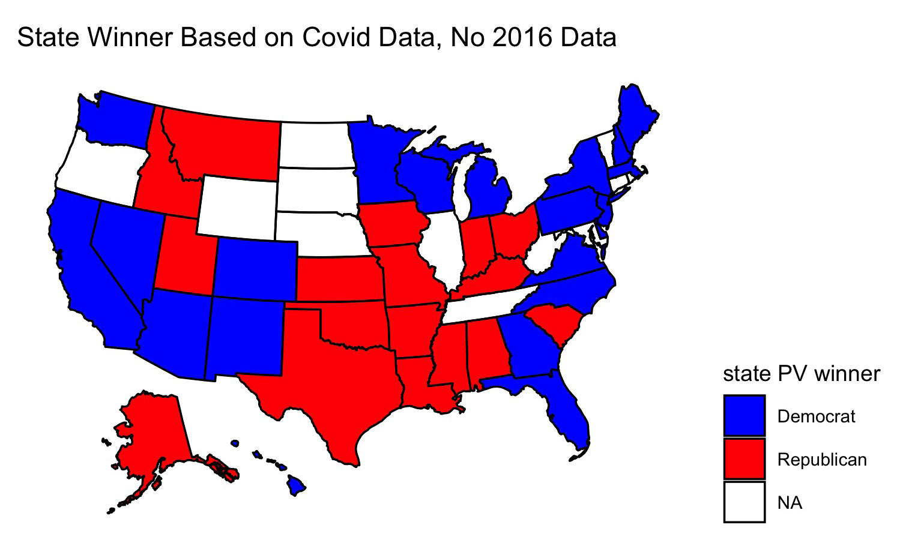

## Predicting the 2020 Election (Rick Brown)

### Week of 10/22: Final Election Prediction

#### Model Formula

#### Model Coefficients & Interpretation

#### Model Description

#### Uncertainty (Interval)

#### 2020 Prediction

Wrong states: Oregon probably will go for Biden. I predict that NE-02 will go for Biden, and ME-02 for Trump (not in model). Additionally, I think Iowa will go to Biden, and in a shocker, so will Texas.

Electoral College Vote: Biden 343, Trump 195
National Popular Vote: Biden 52.36%, Trump 47.64%
Biden CI: (67,419,363 - 68,165,470)
Trump CI: (61,524,412 - 61,819,073)

#### 2000 Prediction (Out-of-Sample Validition)

Wrong states: Arizona, Florida (Bush actually won); New Mexico, Wisconsin, Michigan, Pennsylvania, Delaware (Gore won), 

Electoral College Vote: Gore 239, Bush 298
National Popular Vote: Gore 50.70%, Bush 49.30%
Gore CI: (53,279,361 - 53,913,357)
Bush CI: (51,988,214 - 52,246,513)

[Actual results](https://www.270towin.com/2000_Election/)
Electoral College Vote: Gore 266, Bush 271
National Popular Vote (Two Party Vote): Gore 50.27%, Bush 49.73%

#### 2016 Prediction (In-sample Validition)

Wrong states: New Hampshire (Clinton actually won) and Pennsylvania (Trump actually won)

National Popular vote: Clinton 52.00%, Trump 48.00%
Clinton CI: (64,324,188 - 65,067,859)
Trump CI: (59,564,190 - 59,859,196)

[Actual results](https://www.270towin.com/2016_Election/)
Electoral College Vote: Clinton 304, Trump 227
National Popular Vote (Two Party Vote): Clinton 51.11%, Trump 48.89%

Liked my findings? Find my code [here](https://github.com/rbrown146/Gov_Election_Analytics/tree/gh-pages/Final)

### Week of 10/18: Covid
This election has had many shocks compared with previous elections: protests, a president who doesn't pay much tax, the death of a Supreme Court justice weeks before the elction, and, of course, Covid. How will Covid affect the election? I decided to make a model to find out. But first, here are some maps showing the extent of Covid's spread through the United States:

Between July 1 and October 21 Covid has spread greatly through the USA

It looks like the virus has made inroads into the central part of the country and is doing best there. Deaths have also increased, although by not nearly as much as cases have (perhaps due to the uptick in mask wearing and social distancing)

And now for my model!

**Model**

I used the same base model to predict the outcome of the election. This time, however, I used data on the share of Covid cases as a share of each state's population on September 1 and I used that to predict the polling average for the election in that state. I then fed in Covid data from Oct. 21 to see what the model would predict for the election outcome. Again I simulate 10,000 different election outcomes and include standard deviation in my model. I take the mean prediction for each candidate to predict the election winner. The following map shows my result:

This map looks a lot like most pundits' forecasts at the time. After pondering my model for a while, I realized that it didn't include proper controls. Although at first Coronavirus cases were concentrated mostly on the coasts, more recently Covid has spread fastest in more Republican leaning states, perhaps because people in these states are more likely to emulate the president and go without wearing masks. Since this model looks at changes in covid cases to predict polling, it might actually be modeling concentrations of GOP voters rather than Coronavirus cases since the two go hand-in-hand. I decided to create a new model, this time including 2016 election results to act as a control. I reason that voters in states have more-or-less similar political affiliations as they did four years ago. Obviously there have been demographic changes since then and other factors (e.g. the economy) have changed, but I use this model mostly for comparison:

Only one state changes - Georgia. Now Georgia votes for Trump. This is in line with what happened in 2016, but I wonder now whether the model is leaning mostly on the 2016 election result rather than the coronavirus data when making its prediction. So I created a map of which candidate would win each state if the polls up to September accurately modeled the election outcome:

This map looks identical to the one yielded by the covid model wihout 2016 data. Perhaps, then, covid cases as a fraction of the state's population is not a good predictor of the election outcome - this data seems to get drowned out by other variables in the data. To test this, I looked at the predicted election outcome for each candidate yieled by each model:

These figures are for Georgia.

Polls only -  **Biden 50.06%, Trump 49.94%**. 

Covid Data - **Biden 49.86%, Trump 50.14%**. 

Covid Data + 2016 results – **Biden 49.98%, Trump 50.02%**

These changes are fairly small, and such is the case in other states as well (in North Carolina Biden does 0.6% better in the Covid Data + 2016 results model vs the plain Covid Data model, but in Ohio he does worse by 0.09%). So perhaps changes in the share of Covid cases in each state will have an effect on the outcome of the election, but likely the changes won't be substantial between now and election day.

Liked my findings? Find my code [here](https://github.com/rbrown146/Gov_Election_Analytics/)

### Week of 10/11: Demographics
Last week's histograms were quite interesting (a blue Texas!) but didn't seem like realistic predictions to me. This week I increased the accuracy of my model and tried again. I started out with the same binomial model that related pre-election polling data to the share of Democratic/Republican voters as a share of total voters in each election. I then inputted 2016 data on the number of eligible voters in each state and 2020 polling data. Unlike last time, this time when I was simulating 10,000 different election outcomes I allowed for some variance in the probability of each candidate winning (I added in standard deviation to my model and used a normal distribution to select win probability). Finally, for each candidate I took the mean of the number of expected votes for him in each election simulation. I then produced a map indicating which candidate would win the election assuming the mean vote values corresponded to the result on election day.

Once I produced a map using this more refined model, I adjusted my map by adding in various demographic variables (e.g. the fraction of a state's population that is female) to see how that would affect my outcomes. Adding in these demographic variables yields some wild predictions that are likely inaccurate. 

Ten states had no polling data for this election, so in the maps below they appear without color. And now, without further ado, I present my results:

**Plain map (last week's data):**

This map looks like most pundits' forecasts of the election. Biden wins Michigan, Pennsylvania, and Wisconsin, the three pivotal states that gave Trump the presidency last election. But it's interesting that Biden loses Arizona. Most polls seem to have Biden ahead there, and polling also suggests that it's a given that the Democrats will win the Senate race in Arizona. I'm surprised that Biden loses Arizona but wins North Carolina, Florida, and Ohio, three states that are all polling for Biden but seem to be trending more in Trump's direction. It's worth noting that my model only uses polling data from June to September 2020, so perhaps this explains its prediction.

**Adding in share of female residents:**

The model doesn't change its prediction much once it accounts for the share of each state's population that is female. Using this data, Idaho votes for Biden and Ohio for Trump. Ohio voting for Trump seems plausible to me, but I doubt Biden has a serious chance at winning Idaho. In general women tend to vote for Democrats at greater rates than men, so perhaps the model is capturing an increase in the share of Idaho's population that is female.

Across the United States as a whole results are fairly close for each candidate, as evidenced by this voting density map:

Idaho appears to be about the same shade of blue as Nevada, a state that is fairly competitive in elections. Given Idaho's population boom, the growth of its tech industry, and the tendency for western states to trend towards the Democrats over time, I wouldn't be surprised if Idaho eventually becomes as competitive as Nevada, but that likely will happen in the distant future.

**Adding in share of white residents:**

Building upon the previous model, adding the share of white residents produces strange results. Idaho no longer votes for Biden, but suddenly neither do Florida, Pennsylvania, and Maine. All three of these states gave votes to Trump last election, so perhaps this model is onto something. White voters do tend to vote Republican more than voters of other races. But Alabama and Mississippi vote for Biden, which doesn't seem likely to me. The Democrats ran a competitive candidate for governor in Mississippi yet lost the election, and in Alabama the Democratic candidate for senator only narrowly beat out a truly repulsive Republican one (Roy Moore). I like this model overall, but I think that weighting the share of white voters might produce better results. 

**Leaving out share of white residents, adding in shares of various minority groups:**

This map looks strangest of all. It adds in the share of each state's population that is Asian, Black, Hispanic, and Indigenous. Suddenly Biden loses Colorado and Virginia, two states that were once more competitive but now seem more like safe Democratic states. He also loses Michigan and Wisconsin, and compared to the previous map, no longer holds North Carolina or Mississippi. If Trump had a stronger showing than he did in 2016 I could see him picking up Colorado and Virigina, but I think he'd win Nevada, Minnesota, and New Hampshire first (all are polling closer than Colorado and Virginia). Biden still retains Alabama in this map, but now he holds Maine and wins Montana and Texas. I'm puzzled by why this would be. Alabama has a large Black population, but so do Georgia and North Carolina. Texas has a large Hispanic population, but so do Arizona and Florida. Texas did lean more Democratic last election cycle, and most states trended more Republican, so perhaps this explains some of the variation. The Montana result is most surprising, though, especially when you examine the predicted voteshare in that state.  

Assuming that each candidate received the median number of votes indicated by each histogram, Trump would receive 122,000 votes and Biden 426,000. That would yield a two-party voteshare of **Trump 22.3%, Biden 77.7%**, making Montana _the most Democratic state in the nation_ in 2020. That seems extremely unrealistic, although I do believe that on a good election night Biden could pick up Montana and Texas.

Overall I am fascinated by these models, but I definitely think that they could be refined with weights. I'm also surprised that in none of these predictions does Arizona vote for Biden. I think Biden will win there this election. We'll just have to wait until election night to see what actually happens!

Liked my findings? Find my code [here](https://github.com/rbrown146/Gov_Election_Analytics/blob/gh-pages/10_16/)

### Week of 10/4: Histogram Simulations

This week's blog post models possible outcomes of the 2020 election in key swing states. To generate these histograms, I first made a binomial model relating past election outcomes to pre-election polling data. Specifically, my dependent variables were the share of Democratic/Republican voters in a given election as a fraction of eligible voters. I then fed in the latest polling averages for each party's candidate in each state as well as the size of the 2016 voting eligible population in that state. I repeated this process 10,000 times for each party's candidate and finally generate histograms of the results. The result shows a spread of how many votes Biden and Trump are projected to receive based on current polling averages and past voter turnout for each party.

First, let's look at results from **Nevada**

This Sun Belt state has become more Democratic in recent years, and the histogram supports this trend. It looks like Biden is projected to receive a mean of 549,000 votes while Trump is projected to receive 469,500. If both candidates received this many votes then the two-party voteshare would be **Biden 53.9%, Trump 46.1%** out of 1,018,500 votes cast. Based on a Google search of Nevada's population, this suggests a voter turnout of 1/3 of all Nevadans. (Not all are eligible voters, though.)

Next up is **Wisconsin**

It looks like Biden is projected to receive a mean of 1,562,000 votes and Trump 1,429,000 votes. Such an election outcome would yield a two-party voteshare result of **Biden 52.2%, Trump 47.8%** out of 2,991,000 votes cast. If this outcome occurred then it would be nearly a flip of the 2016 election. This result would be closer than the model's projections for Nevada, which makes sense given that Nevada voted for the Democratic candidate in 2016 while Wisconsin did not.

Fellow Midwestern state **Ohio** is next

Always a swing state, last cycle Ohio was notable for swinging further to the right than it has in recent memory. This model suggests that Ohio will continue its GOP voting streak this election: Trump is projected to receive a mean of 2,822,000 votes and Biden 2,724,000. This would put the two-party voteshare at **Biden 49.1%, Trump 50.9%** out of 5,546,000 votes cast. 

Finally, let's look at **Texas**

The results are surprising. The model projects a mean of 5,515,000 votes for Biden and 4,844,000 votes for Trump. That would result in a two-party voteshare of **Biden 53.2%, Trump 46.8%**. If this were true then Biden would have a larger victory in Texas than he would in Wisconsin. Given the conservative history and close polling of Texas, however, this outcome seems highly unlikely. Even if the outcome fell on the left tail of the Democratic simulated voteshare, Biden would still be projected to win. Therefore, it seems likely that there is some flaw in the model.

The results found in this blog post should give Biden supporters reason to be optimistic, assuming the model's projections hold true. Given the crazy events of 2020, perhaps a Democratic Texas isn't that implausible after all.

Liked my findings? Find my code [here](https://github.com/rbrown146/Gov_Election_Analytics/blob/gh-pages/2020histograms.R)

### Week of 9/27: Incumbency

This election cycle there is an incumbent running for reelection. What does this mean for President Trump, and should we expect 2020 to differ from previous years?

#### Why 2020 Could be Different

It's a well observed fact that incumbent candidates are reelected at extraordinary rates. (Think of how many presidents over the past 70 years failed to win reelection.) One might think that this is due to constitutent loyalty to the exisiting holder of a particular office. However, surprisingly, it turns out that in the abstract voters have no preference for [incumbent candidates.](https://hollis.harvard.edu/primo-explore/fulldisplay?docid=TN_cdi_proquest_journals_1680832786&context=PC&vid=HVD2&search_scope=everything&tab=everything&lang=en_US) Rather, it seems that sitting presidents are able to direct spending to pivotal districts, thereby using the power of their office to [boost support.](https://hollis.harvard.edu/primo-explore/fulldisplay?docid=TN_cdi_proquest_journals_1018073231&context=PC&vid=HVD2&search_scope=everything&tab=everything&lang=en_US)

Does that mean that President Trump is likely to be reelected? Several factors suggest otherwise. For one, the coronavirus has ravaged America, shutting down gatherings and disrupting Americans' normal way of life. Additionally, because of the shutdowns, American businesses and workers are hurting. Unemployment is high and GDP growth is negative. If incumbents have an advantage due to crafty use of resources, then given the chaos that is America at the moment, this situation will not hold for the 2020 election. Perhaps voters may associate the president with the stimulus bills passed by Congress earlier this year, but there is no indication that that is the case, and even if it were, the goodwill earned from those pieces of legislation may have worn off by now. The most recent instance that I can recall of the president using his power to restore normalcy to the country was when he claimed to be "bringing back Big 10 football", which hardly seems like the type of resource deployment that is likely to sway voters.

The state of the economy aside, the strength of the incumbency effect seems to be wearing off in recent years [as voters become increasingly polarized.](https://hollis.harvard.edu/primo-explore/fulldisplay?docid=TN_cdi_proquest_journals_2185149144&context=PC&vid=HVD2&search_scope=everything&tab=everything&lang=en_US) Recall that the president did not win the national popular vote last election. This was also true at the state level, as he carried several key states such as Pennsylvania, Wisconsin, and Michigan with only a plurality and not majority of the vote. Voters turned to third party candidates in higher numbers than usual during the 2016 election, in part because they did not like either major party candidate. In this election, however, President Trump's opponent Joe Biden does not provoke the same degree of disgust as Hillary Clinton did in 2016, judging from the polls. Meanwhile, Trump's approval rating has stayed nearly constant during his first term, suggesting that he is unlikely to pick up additional supporters this election cycle.

#### Playing with Models

Interestingly, not all incumbents are treated the same. At the presidential level, while incumbent *candidates* tend to be reelected at high rates, incumbent *parties* that are not running incumbent candidates tend to lose elections more often than not. (Thank you to Professor Ryan Enos for providing this fact!) I decided to make a model to analyze differences in reelection rates for incumbent parties when they run incumbent candidates as opposed to new candidates in elections. To do this, I first found a high quality model produced by my classmate [Yao Yu](https://itsyaoyu.com/blog/gov-1347-polls/) that used Florida state polls and GDP data to predict the state winner during the 2020 election. I tweaked the model so that it utilized state economic data rather than national data, and I changed the economic variable of interest from GDP data to the state unemployment rate. Finally, I fed polling data from North Carolina and Iowa into this new model to predict the winner of those states in 2020.

The model works by looking at polls taken no more than 20 weeks out from the election, and it combines this information with unemployment data taken in April during the year of the election to make its predictions. (Why April? Political scientists have shown that, to the extent that voters look at economic data at all, they scrutinize data from towards the beginning of election year when judging an incumbent party's [performance.](https://hollis.harvard.edu/primo-explore/fulldisplay?docid=TN_cdi_askewsholts_vlebooks_9781400888740&context=PC&vid=HVD2&search_scope=everything&tab=everything&lang=en_US)) Using election and polling data from as far back as 1976, the model is then trained on some previous years' data while some data (40% of available data) is held in reserve for testing. The model is then applied to the testing data and the entire dataset to see how accurately it can predict the outcome of past elections. Once that is determined, the model is applied to current 2020 polling data to predict whether Trump or Biden will win a given state.

For each state I model two different scenarios: when an incumbent incandidate is running for reelection (which I call the "complex model"), and when an incumbent party is running a new candidate for election (which I call the "simple model"). Results are shown below:

**North Carolina**

For 2020, the **complex model** predicts **Biden 50%, Trump 46%.** The **simple model** predicts **Biden 50%, Trump 48%**

**Iowa**

For 2020, the **simple model** predicts **Biden 37%, Trump 55%**. The **complex model** predicts **Biden 37%, Trump 50%**.

Are these models correct? Likely not. Biden earning only 37% of the vote in Iowa seems far off to me. Even though the models perform well on the test data, polls for each election are likely correlated with each other. Additionally, the models would likely be more accurate if they took into account demographic factors for each state and if there was more training data. If the models happen to be correct, however, then expect to see Iowa stay red and North Carolina turn blue in 2020. 

Liked my findings? Find my code [here](https://github.com/rbrown146/Gov_Election_Analytics/blob/gh-pages/04-Incumbent.R)

### Week of 9/20: Polling

#### Comparing Polls
How should one design a poll to best predict an election? Of course there is no one answer to this, so it is interesting to examine the approaches taken by various top pollsters. In this post I'll examine two such models: one by [FiveThirtyEight](https://fivethirtyeight.com/features/how-fivethirtyeights-2020-presidential-forecast-works-and-whats-different-because-of-covid-19/) and the other by [The Economist](https://projects.economist.com/us-2020-forecast/president/how-this-works).

To make its prediction, **FiveThirtyEight** takes in polls and adjusts them in three ways: by how likely participants are to vote, by the political leaning of the pollster, and by the closeness of the polling date to election day. Of course there are other adjustments, too, especially in this time of uncertainty – FiveThirtyEight adjusts polls to account for economic uncertainty, number of COVID cases, and how difficult it is to vote in a particular state. In general, the approach is to rely mostly on polling data; fundamentals (e.g. growth in GDP since the last election) are weighted less than polls, especially as election day approaches. Predictions also are weighted to account for prior election results, demographics of those polled, incumbency effect, home state advantage, and how much a given state usually swings.

Unlike FiveThirtyEight, **The Economist** relies more on fundamentals. The Economist created numerous models based on prior election data that were weighted based on factors like GDP growth and how long a party has held the presidency (The Economist penalizes a party for holding the office for more than two terms). This process is then repeatedly on the state level, adjusting for partisan lean and correlating results for states with those of other states that have similar characteristics. Like FiveThirtyEight's model, adjustments are made for states based on prior election results, number of likely voters, and how much each state typically swings between elections.

While both pollsters use polls and fundamentals, the importance of each factor varies by pollster. Both FiveThirtyEight and The Economist recognize that there will be partisan leans to polls and bumps for certain candidates that are only temporary. They attempt to account for this. Both view the economy as a noisy predictor of the election. Both also vary the weight assigned to fundamentals and polls over time. However, the Economist does so much later in the process; its model does not use polls at all until about the end of June, and it does not extensively rely on polls until the week of election day. In contrast, by the end of June FiveThirtyEight's model assigns nearly 70% weight to polls, and this percentage jumps to nearly 84% when the election is still two months away. The Economist's model seems to rely more on coding and statistical techniques than does FiveThirtyEight's model.

Which model is best? Both have fairly good track records. (Although this is the first time the Economist is using its model, the model has been used to predict prior elections.) Because of the increasing polarization of America I'm inclined to believe that there will be fewer swings between elections, in which case a more fundamentals-based model will give the best results. Polls should also reflect this polarization (and they do), but as evidenced by the 2016 election, certain demographics seem to be underrepresented in polls. (E.g. white men without college degrees.) That being said, the polls may not have been as far off in 2016 as many might believe (see below blog post). So there is reason to believe that both models could yield accurate predictions. Given the turbulence caused by the coronavirus epidemic, however, I think it is best to rely more on polling this cycle since it isn't clear if the fundamentals will apply when there are huge shocks to the economy and a virus circulating rampantly through the population.

#### Analyzing 2016 Polls
After Donald Trump won the presidential election in 2016, the American public was shocked. The polls had led most people to expect a Clinton victory, yet that was not so. Many faulted pollsters for overlooking the Rust Belt region when forming their predictions. But just how far off were the polls in these states compared to previous elections, and was there reason to criticize most election forecasts?

Let's first take a look at Wisconsin. Using past polling data gathered within a week out from prior elections we can plot the average polling result from the eventual winner in comparison to actual voting data for that election:

Compared to the week-out polls, Trump received about 5 points more support than expected. The polls were certainly off by more than in 2012 (~3 pts off) and 2008 (~2 pts off). But compared to the 1984 election (~7 pts off) and 1988 election (~5 pts off), the error doesn't seem unreasonable. Of course, since the 80s technology has improved, and we would expect polling data to improve along with it. It isn't clear, then, how we should interpret this result.

Perhaps taking a look at Michigan will help somewhat: 

Michigan seems to be better polled than Wisconsin. The polls for 2016 were only off by about 3 points. This is an improvement from 2012 (~5 pts off), and 2008 (~4 pts off). Polling from 1988 appears to be off by about 5 points.

How does this compare to states outside the Midwest? Let's look at Florida:

Florida's polls were only off by about 2 points in 2016, an amount comparable to the error from 2012 and much smaller than in 2004 (~4 pts) though larger than in 2008 (~1 pt). Of course, as a perennial swing state, Florida might be better polled than most states. But it is encouraging to see that Michigan's polls weren't much further off than polls in Florida.

Next, let's look at Missouri, another Midwestern state but one that hasn't been competitive since 2008. (But a state for which there is still much polling data):

Polls for 2016 are noticeably off compared to other years. It looks like the difference between the predicted and actual outcome is 7 points! Prior to 2016 the polls were most off in the year 1996 by about 3 points. Michigan was definitely better polled in 2016 than Missouri, and even Wisconsin's polling looks better in comparison. While results for Missouri are probably off due to underpolling, it is worth noting that the state had competitive races for Senate and governor in 2016 – consequently, we would expect pollsters to devote considerable amounts of resources to surveying Missourians that year. 

Finally, let's look at some correlation statistics for each state. The table below shows R-squared values for the relationship between state polling data and the national popular vote (column 2) and state popular vote (column 3). To measure the noteworthiness of 2016 results, an R-squared value is calculated for each state with and without results from 2016:

Removing results for 2016 doesn't change state polling/vote R-squared values for Michigan and Florida! Results from 2016 weaken R-squared values for state polling/vote in Wisconsin by 0.03 and in Missouri by 0.05.

So what should we conclude about state polling in 2016? While the polls certainly were off in some key states, they don't appear to be too far off in comparison to state polls for other recent presidential elections. Of the states examined, polling was best in Florida and Michigan. Polling in both Wisconsin and Missouri noticeably differed from prior elections, enough to affect R-squared values. Whether it warrents shaming pollsters is debateable, however. Regardless, one can imagine that these states will be substantially better polled in this upcoming election as compared to the 2016 one.  

Liked my findings? Find my code [here](https://github.com/rbrown146/Gov_Election_Analytics/blob/gh-pages/Polling.R)

### Week of 9/13: It's The Economy, Stupid

It has long been said that the economy decides elections. Political scientists have argued that [there is a noticeable correlation](https://hollis.harvard.edu/primo-explore/fulldisplay?docid=TN_cdi_askewsholts_vlebooks_9781400888740&context=PC&vid=HVD2&search_scope=everything&tab=everything&lang=en_US) between an incumbent party's vote share and economic measures like GDP, RDI, and the inflation rate. Is this truly the case? In this blog post I use presidential election data since 1948 to show that while there is some correlation between RDI/GDP and an incumbent party's vote share, other measures like the inflation rate, unemployment rate, and stock market performance are much weaker measures.

#### GDP and RDI

Plotting scatterplots between incumbent party voteshare (popular two party vote, or PV2P) and GDP and RDI respectively shows that a positive, moderately strong correlation exists:

 

The graphs suggest that GDP is a slightly better predictor than RDI. But numerically, just how good are these measures at predicting vote share? Examining the coefficients for the line of best fit for each graph, we can see that GDP has a statistically significant t value (less than 1.96) while RDI does not. In simpler terms, that means that the correlation between GDP and two party voteshare is highly unlikely to be random while the correlation between RDI and two party voteshare might be due to chance given the data we have:

GDP

RDI

Leaving out data for the 2016 election, we can test the accuracy of the models for GDP and RDI respectively by predicting what share of the popular vote Clinton should earn as compared to what she actually earned. Our predictions are the following:

**Actual Clinton Voteshare** - 51.16%

**GDP Model Clinton Voteshare** - 50.31%

**RDI Model Clinton Voteshare** - 47.97%

Here, too, it seems like GDP is a better predictor than RDI. But what do the two models predict Trump's voteshare will be in 2020?

**GDP Model Trump Voteshare 2020** - 21.26%

**RDI Model Trump Voteshare 2020** - 80.33%

Neither of these predictions seems realistic. All of the polls seem to show Trump neck-in-neck with Biden. So why are the models off by so much? GDP declined tremendously in the second quarter of 2020 due to COVID shutdowns while RDI increased as a result of stimulus checks and increased unemployment benefits. Since both were temporary changes caused by a pandemic, I doubt that either prediction will come close to accurately describing this year's election.

#### Inflation and Unemployment

Plotting scatterplots between incumbent party voteshare and the inflation and unemployment rates respectively shows that weak correlations exist:

 

Unsurprisingly, neither variable is a statistically significant measure of incumbent party voteshare. In fact, both seem to be noiser predictors than GDP and RDI:

Inflation

 

Unemployment

Note the positive sign on the coefficient for unemployment. That implies that as unemployment increases then the incumbent party's voteshare increases, which is likely not true. Here is what the two models predict Clinton should have earned in 2016:

**Actual Clinton Voteshare** - 51.16%

**Inflation Model Clinton Voteshare** - 49.66%

**Unemployment Model Clinton Voteshare** - 52.04%

By this metric, unemployment seems to be about as accurate a predictor as GDP, while inflation is more precise than RDI. Now for 2020:

**Inflation Model Trump Voteshare 2020** - 49.75%

**Unemployment Model Trump Voteshare 2020** - 52.18%

These predictions seem much more accurate than the ones yielded by GDP and RDI. But remember that our unemployment model has unemployment positively correlated with incumbent party voteshare while inflation has a large t value. So while these predictions might seem accurate, they should be viewed skeptically.

#### Stock Market Opening Value and Number of Stock Trades

Plotting scatterplots between incumbent party voteshare and the stock market opening values and the number of stock trades respectively shows that weak correlations exist here too:

 

There seem to be many datapoints clustered around x values close to the origin while a few outliers draw the regressions outward. The t values for the coefficients for both variables indicate this mediocre correlation:

Stock Market Opening Value

 

Number of Stock Trades

The Clinton voteshare predictions for both models are as follows:

**Actual Clinton Voteshare** - 51.16%

**Stock Market Opening Model Clinton Voteshare** - 48.46%

**Stock Market Trades Model Clinton Voteshare** - 48.92%

These predictions are further off than most of the other models. But let's see what they predict for 2020:

**Stock Market Opening Model Trump Voteshare 2020** - 48.33%

**Stock Market Trades Model Trump Voteshare 2020** - 48.18%

These predictions are virtually identical as the ones yielded for Clinton in 2016. However, since 2016 there has been a tremendous increase in stock trading volume, but the coefficient in the stock trading model in so small that it does not affect the prediction. Meanwhile, at the time when the data was collected the stock market's opening value was close to what it was in 2016, so it is unsurprising that this prediction is nearly the same as it was in 2016. 

#### Closing

While a number of economic variables can be used to predict the popular vote for an incumbent party, it seems that GDP and RDI are the most accurate (in normal circumstances). However, given the temporary distortions to the economy caused by the coronavirus epidemic, these variables do not seem like good predictors for this upcoming election. *Different* models are needed for these special times.

Liked my findings? Find my code [here](https://github.com/rbrown146/Gov_Election_Analytics/tree/gh-pages/Blog%209-13)

### Week of 9/6: Past Insights

Analyzing swing states has long been a hallmark American election forecasts, and 2020 looks to be no different. This time there is much buzz about a wider field of states being in play than ever before: staples like Iowa, Ohio, Florida, and New Hampshire are frequently mentioned, but this time so are more unusual choices like Arizona, Georgia, Michigan, Pennsylvania, Wisconsin, and Texas. Perhaps this is because of the chaos caused by the coronavirus epidemic, or perhaps due to the drama of the Trump administration. Regardless of why, are this many states actually in play for Joe Biden, and if so, is this as unusual as it's made out to be?

Well, let's first look at a summary of each party's statewide margin of victory for presidential elections since 1980:

Even since 1980 candidates seem to be running closer races in most states; with the exception of Utah, Idaho, and Wyoming, most states seem to very widely in intensity from strongly Republican to more moderately so (or perhaps even Democratic). This trend away from Republicanism bodes well for Biden. But given the many changes that have happened since 1980, like the downfall of the USSR and creation of Google, more relevant insights for the 2020 election will likely come from the past two decades.

In this shorter timespan it still seems evident that many states are not solidly Republican or Democratic. Democratic strongholds in the Northeast and Rust Belt region appear to be increasingly less Democratic while Republican strength in the Southeast is diminishing. (There are exceptions, of course - New York, Kentucky, and West Virginia vote increasingly for a particular party within this time frame.) The Southwest and Texas look very much in flux.

Graphing the change in party vote share in each state since the previous election should give us greater insight into the exact political trends by region:

The country seems to have become more Democratic after the presidencies of Ronald Reagan and George W. Bush and more Republican during the presidency of Barack Obama. The pendulum metaphor of American politics seems to hold, although lately it has weakened:

The country has trended more Republican in the past few elections with the exceptions of Arizona, California, Texas, and Georgia. Besides California all of these states have been considered swing states this election by at least some notable pundits. Assuming that these states are becoming Democratic faster than traditionally Democratic states are becoming Republican (which looks true), this should benefit Biden. Iowa seems to be going in the opposite direction, however, so it seems a stretch to call it a swing state this cycle. Overall it looks like, at best, presidents can only weakly grow their support when running for reelection, and in many states they lose voteshare. This will not benefit Donald Trump.

Just how many states have been competitive the past few cycles? The map below looks at states in which the two party voteshare for president was 5 points or less; it then colors states based on how much the voteshare changed from the previous election.

The trend seems to be going downward: from a peak of 12 in 2000 to a low of four in 2012, although the number since increased this past election. As America becomes more polarized the number of competitive states diminishes. This being the case, it does seem highly unusual that there are as many toss-up states this cycle as forecasted. But as for the states that are considered competitive, is this truly the case? As the map above indicates, lately it is highly unusual for states to swing by more than 2 points during a president's reelection bid (compare the number of purple states in 2004 and 2012 to the other years). If this trend holds true for this election then most of the states we consider swing states should have been carried in 2016 with a margin of victory of no more than 2% since states with a voteshare gap greater than 2% are highly unlikely to flip for another candidate.

As the map above indicates, many states considered swing states by pundits were in fact carried by this margin. However, North Carolina, Georgia, Arizona, Ohio, Texas and Iowa do not fit into this category. Voting trends discussed previously seem to suggest that Arizona is in fact competitive, but it seems like a stretch to label the remainder as swing states absent a large deviation from past voting patterns.
